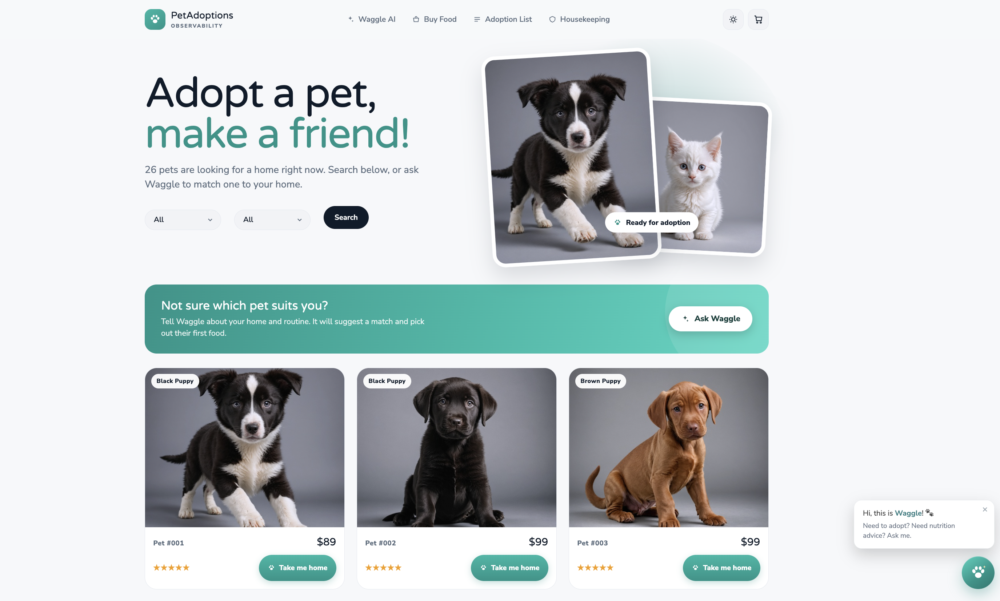

## One Observability Demo

This repo contains a sample application which is used in the One Observability Demo workshop here - https://observability.workshop.aws/



The PetAdoptions storefront: browse adoptable pets, buy pet food, and ask the Waggle AI assistant for a match and nutrition advice, all instrumented end to end with AWS observability.

## Documentation

Full documentation is published at the [GitHub Pages site](https://aws-samples.github.io/one-observability-demo/).

### Guides

| Guide | Description |
|-------|-------------|
| [Architecture Overview](https://aws-samples.github.io/one-observability-demo/architecture/overview/) | System architecture, microservices, pipeline stages, and observability design |
| [Deployment Template](https://aws-samples.github.io/one-observability-demo/deployment/codebuild-template/) | CodeBuild CDK deployment parameters and advanced usage |
| [Cleanup Script](https://aws-samples.github.io/one-observability-demo/operations/cleanup/) | Post-workshop resource cleanup instructions and troubleshooting |
| [CDK Cleanup](https://aws-samples.github.io/one-observability-demo/operations/cdk-cleanup/) | CDK-specific stack teardown procedures |
| [Seeding Guide](https://aws-samples.github.io/one-observability-demo/operations/seeding/) | Database and application seeding instructions |
| [Image Generation](https://aws-samples.github.io/one-observability-demo/operations/image-generation/) | Pet food image generation setup |
| [Application Redeployment](https://aws-samples.github.io/one-observability-demo/deployment/redeployment/) | How to redeploy individual microservices |
| [CodeConnection Setup](https://aws-samples.github.io/one-observability-demo/deployment/codeconnection/) | GitHub CodeConnection and Parameter Store integration |
| [ECS Port Forwarding](https://aws-samples.github.io/one-observability-demo/operations/ecs-port-forwarding/) | Local access to ECS services via port forwarding |

### API Reference

The CDK construct library API reference is available at the [API Reference](https://aws-samples.github.io/one-observability-demo/api/) page, or browse the source under [`src/cdk/lib/`](./src/cdk/lib/).

## Security

See [CONTRIBUTING](CONTRIBUTING.md#security-issue-notifications) for more information.

## Deployment Instructions

### Prerequisites

- IAM role with elevated privileges
- AWS CLI installed and configured
- Appropriate AWS permissions for CloudFormation, CodeBuild, and related services

### CloudFormation Templates

This repository provides three CloudFormation templates (see [ADR-0001](https://aws-samples.github.io/one-observability-demo/architecture/decisions/0001-deployment-template-split-and-safer-teardown/)):

- **[codebuild-deployment-template.yaml](./src/templates/codebuild-deployment-template.yaml)** - Full deploy bootstrapper. Waits for the CDK pipeline and reports status. Does NOT auto-roll-back or tear down on failure.
- **[codebuild-deployment-lite.yaml](./src/templates/codebuild-deployment-lite.yaml)** - Lite deploy bootstrapper. Same deploy flow, smallest footprint, no cleanup machinery. Supports fire-and-forget (`pWaitForDeployment=false`).
- **[teardown-stepfunction.yaml](./src/templates/teardown-stepfunction.yaml)** - Standalone, opt-in teardown. Deployed and invoked deliberately; supports a dry-run preview. Never triggered automatically.

Neither deploy template tears down the CDK stacks on failure: a failed or slow deploy leaves them in place for inspection and retry.

### Quick Start

Deploy the workshop using the CodeBuild CDK deployment template:

```bash
aws cloudformation create-stack \
  --stack-name OneObservability-Workshop-CDK \
  --template-body file://src/templates/codebuild-deployment-template.yaml \
  --capabilities CAPABILITY_NAMED_IAM \
  --parameters \
    ParameterKey=pOrganizationName,ParameterValue=aws-samples \
    ParameterKey=pRepositoryName,ParameterValue=one-observability-demo \
    ParameterKey=pBranchName,ParameterValue=main \
    ParameterKey=pWorkingFolder,ParameterValue=src/cdk
```

For step-by-step deployment instructions, source options (CodeConnection or S3), and the local iteration loop, see the [Quick Start guide](https://aws-samples.github.io/one-observability-demo/deployment/quick-start/).

## Cleanup

Teardown is deliberate: no deploy template tears down the CDK stacks automatically. After completing the workshop, clean up your AWS resources to avoid ongoing charges, by either:

- Running `npm run cleanup -- --discover` from `src/cdk` (the discovery-based cleanup script), or
- Deploying **[teardown-stepfunction.yaml](./src/templates/teardown-stepfunction.yaml)** and starting its state machine with `{"confirm":"DELETE"}` (add `"dryRun":true` to preview what would be deleted first).

For comprehensive cleanup instructions, troubleshooting, and safety guidelines, see:

**🧹 [Cleanup Script Documentation](https://aws-samples.github.io/one-observability-demo/operations/cleanup/)**

## License

This library is licensed under the MIT-0 License. See the LICENSE file.
