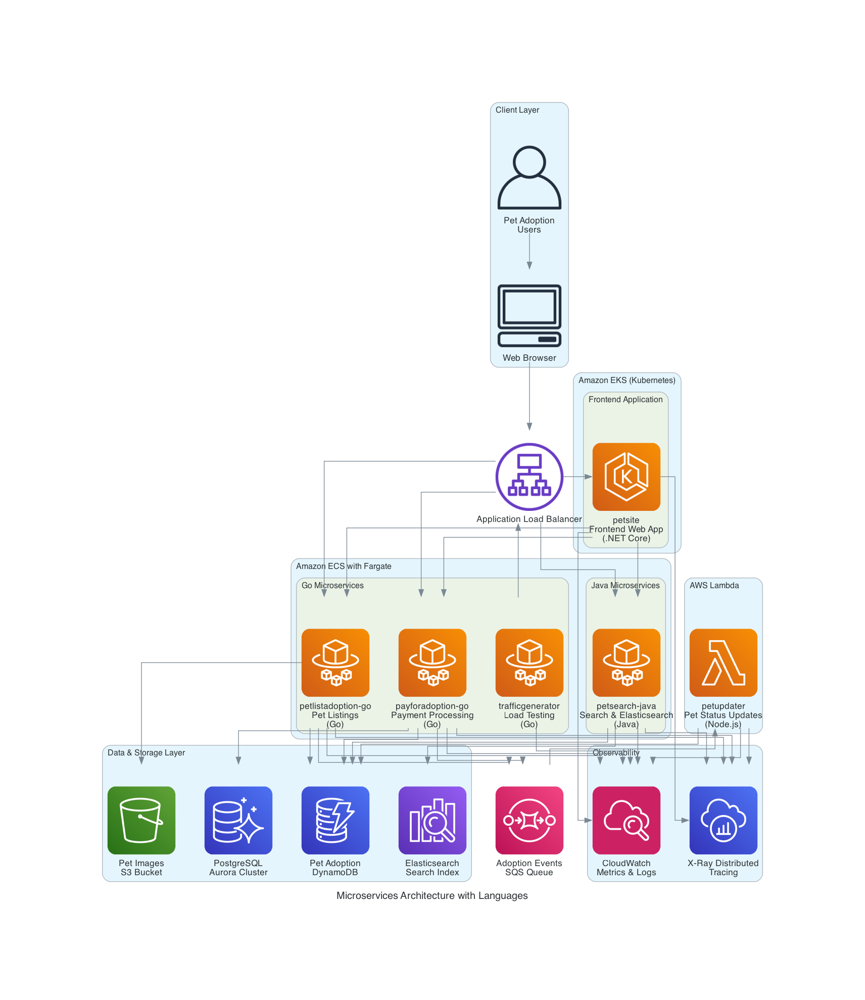
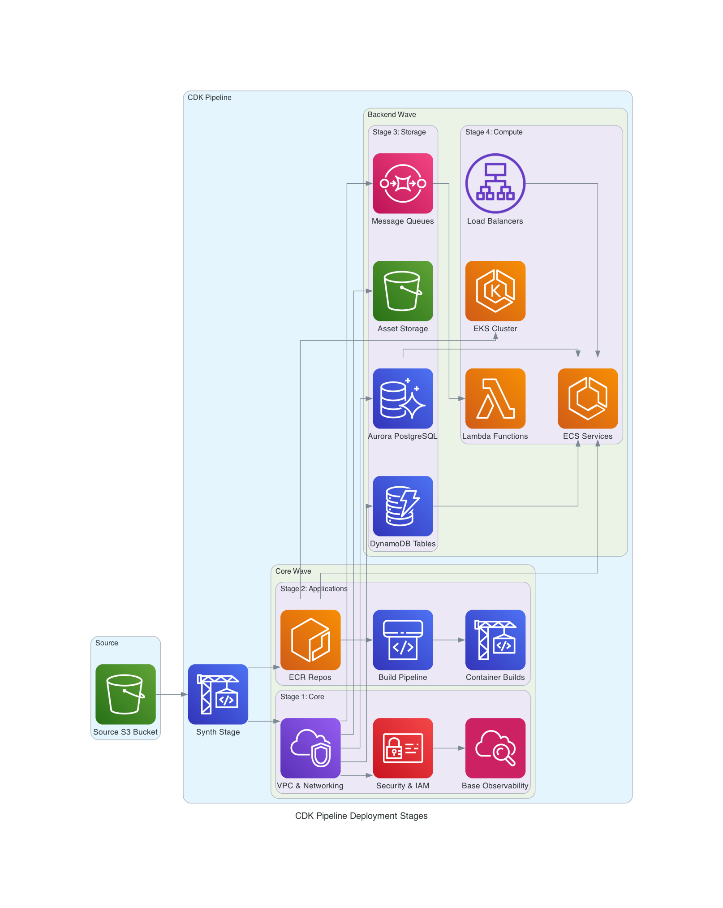
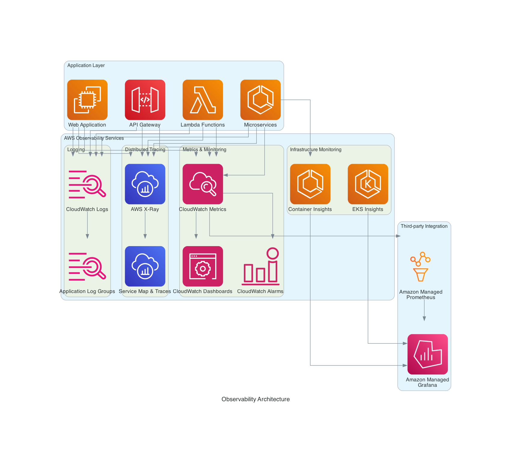

<!--
Copyright Amazon.com, Inc. or its affiliates. All Rights Reserved.
SPDX-License-Identifier: Apache-2.0
-->
# One Observability Demo - Infrastructure Architecture

## Overview

The One Observability Demo is deployed using AWS CDK (Cloud Development Kit) with a multi-stage pipeline architecture. The infrastructure is organized into distinct deployment stages that build upon each other, creating a comprehensive observability platform for demonstrating AWS monitoring and observability services.

## CDK Pipeline Architecture

The deployment follows a CDK Pipelines pattern with the following structure:

### Pipeline Structure

The CDK Pipeline (`CDKPipeline` class) orchestrates the deployment through two main waves:

1. **Core Wave** - Contains foundational infrastructure and application containers
2. **Backend Wave** - Contains storage and compute resources

### Deployment Stages

#### 1. Core Stage
**Purpose**: Deploys foundational infrastructure components required by all other stages.

**Resources Deployed**:
- **VPC and Networking**: Virtual Private Cloud with public/private subnets, NAT gateways, and internet gateway
- **Security Groups**: Network security configurations for different service tiers
- **IAM Roles and Policies**: Identity and access management for services
- **CloudTrail**: Audit logging for API calls
- **VPC Endpoints**: Private connectivity to AWS services
- **Core observability infrastructure**: Base monitoring and logging setup

**Key Components**:
- `CoreStack` - Main infrastructure stack
- Network isolation and security boundaries
- Foundational observability components

#### 2. Applications Stage (Containers Pipeline)
**Purpose**: Builds and manages containerized applications using ECR and CodePipeline, and deploys serverless functions.

**Resources Deployed**:
- **Amazon ECR Repositories**: Individual container registries for each microservice
- **CodePipeline**: Dedicated CI/CD pipeline for building container images
- **CodeBuild Projects**: Build environments with Docker support for containerizing applications
- **IAM Roles**: Pipeline and CodeBuild service roles with ECR permissions
- **S3 Artifact Bucket**: Storage for pipeline artifacts
- **AWS Lambda Function**: Single serverless function for pet status updates

**Pipeline Architecture**:
1. **Source Stage**: Retrieves source code from S3 bucket (same as main CDK pipeline source)
2. **Build Stage**: Parallel execution of container builds for all microservices

**Microservices Built** (5 applications):
- **payforadoption-go** (Go): Payment processing service
- **petlistadoption-go** (Go): Pet listing service
- **petsearch-java** (Java): Pet search service with Elasticsearch integration
- **petsite** (.NET Core): Web frontend (deployed to EKS)
- **trafficgenerator** (Go): Load testing and traffic simulation service

**Lambda Function**:
- **petupdater** (Node.js): Function for updating pet adoption status in DynamoDB

**Key Features**:
- **Parallel Build Execution**: All 5 microservices build simultaneously for faster deployment
- **Automatic Image Scanning**: ECR vulnerability scanning enabled on push
- **Docker Multi-stage Builds**: Optimized container images with security scanning
- **Immutable Tags**: Container images tagged with 'latest' and build-specific tags
- **Cross-stage Integration**: Built images are consumed by Compute Stage for ECS/EKS deployment
- **Serverless Integration**: Lambda function deployed alongside containerized services

#### 3. Storage Stage
**Purpose**: Deploys data persistence and storage solutions.

**Resources Deployed**:
- **Amazon DynamoDB**: NoSQL database for application data
- **Amazon Aurora PostgreSQL**: Relational database for structured data
- **Amazon S3**: Object storage for assets and static content
- **Amazon SQS**: Message queuing for decoupled communication
- **Workshop Assets**: Pre-populated data and images for the demo

**Key Components**:
- `StorageStack` containing:
  - `QueueResources` - SQS queues for messaging
  - `WorkshopAssets` - S3 buckets with demo data
  - `DynamoDatabase` - NoSQL tables
  - `AuroraDatabase` - PostgreSQL cluster

#### 4. Compute Stage
**Purpose**: Deploys compute resources and container orchestration platforms.

**Resources Deployed**:
- **Amazon ECS**: Container orchestration service with Fargate support
- **Amazon EKS**: Kubernetes cluster for container workloads
- **Application Load Balancers**: Traffic distribution for containerized services
- **Auto Scaling Groups**: Dynamic scaling capabilities for ECS and EKS
- **EC2 Instances**: Worker nodes for EKS cluster (optional)

**Key Components**:
- `ComputeStack` containing:
  - `WorkshopEcs` - ECS cluster with Fargate support
  - `WorkshopEks` - EKS cluster with worker nodes
  - Load balancers and target groups for service discovery
  - Auto scaling configurations for both ECS and EKS

**Note**: Lambda functions are deployed in the Applications Stage as part of the MicroservicesStack, not in the Compute Stage.

## Pipeline Flow

```
Source (S3) → Synth → Core Wave → Backend Wave
                        ↓           ↓
                   [Core Stage]  [Storage Stage]
                   [Applications] [Compute Stage]
```

### Wave Execution

1. **Core Wave** executes first and contains:
   - Core infrastructure (networking, security, observability)
   - Applications/Containers pipeline (builds container images)

2. **Backend Wave** executes after Core Wave and contains:
   - Storage resources (databases, queues, object storage)
   - Compute resources (ECS, EKS, Lambda, load balancers)

### Stage Dependencies

- **Applications Stage** depends on Core Stage for networking and security
- **Storage Stage** depends on Core Stage for VPC and networking
- **Compute Stage** depends on both Core and Storage stages for infrastructure and data persistence

## Key Features

### Security
- **AWS NAG Suppressions**: Automated security compliance checking with documented exceptions
- **IAM Least Privilege**: Minimal required permissions for each service
- **VPC Isolation**: Network segmentation and private subnets
- **Encryption**: Data encryption at rest and in transit

### Observability
- **AWS X-Ray**: Distributed tracing for microservices
- **Amazon CloudWatch**: Metrics, logs, and alarms
- **AWS CloudTrail**: API audit logging
- **Container Insights**: ECS and EKS monitoring
- **Application Performance Monitoring**: End-to-end observability

### Scalability
- **Auto Scaling**: Dynamic resource scaling based on demand
- **Load Balancing**: Traffic distribution across multiple instances
- **Serverless Components**: AWS Lambda for event-driven processing
- **Container Orchestration**: ECS and EKS for scalable container workloads

## Configuration

The pipeline is configured through the `CDKPipelineProperties` interface:

- **Source Configuration**: S3 bucket and key for source code
- **Application List**: Container definitions for applications to build
- **Database Configuration**: Aurora PostgreSQL engine version
- **Asset Paths**: S3 paths for demo assets and images
- **Tagging Strategy**: Consistent resource tagging across stages

## Deployment Process

1. **Source Stage**: Code is retrieved from S3 bucket
2. **Synth Stage**: CDK synthesizes CloudFormation templates
3. **Core Wave Deployment**:
   - Core infrastructure is deployed first
   - Applications pipeline builds container images in parallel
4. **Backend Wave Deployment**:
   - Storage resources are deployed
   - Compute resources are deployed with dependencies on storage

This architecture provides a robust, scalable, and observable platform for demonstrating AWS monitoring and observability capabilities across containerized and serverless workloads.

## Architecture Diagrams

The following diagrams illustrate the infrastructure architecture and deployment flow:

### Complete Architecture Overview


This diagram shows the complete infrastructure architecture including the detailed container pipeline with programming languages for each microservice and the Lambda function.

### Applications Stage - Complete Architecture


This diagram provides a detailed view of the Applications Stage, showing how 5 microservices (Go, Java, .NET Core) are built in parallel, pushed to individual ECR repositories, and includes the single Lambda function (Node.js) deployment.

### Microservices Architecture & Runtime Deployment


This diagram illustrates the runtime architecture showing how the built microservices are deployed across ECS and EKS with their respective programming languages, the single Lambda function integration, data access patterns, and observability integration.

### Deployment Stages Flow


This diagram illustrates the CDK pipeline deployment flow through the Core Wave and Backend Wave stages.

### Stage-Specific Resource Diagrams

#### Core Stage Resources


Shows the foundational networking, security, and observability infrastructure deployed in the Core Stage.

#### Storage Stage Resources


Illustrates the data persistence layer including databases, object storage, and message queuing systems.

#### Compute Stage Resources


Details the compute infrastructure including container orchestration and load balancing (Lambda functions are deployed in the Applications Stage).

#### Observability Architecture


Demonstrates the comprehensive observability stack with metrics, logging, tracing, and monitoring capabilities.

## Getting Started

To deploy this infrastructure:

1. Ensure you have AWS CDK installed and configured
2. Navigate to the `src/cdk` directory
3. Install dependencies: `npm install`
4. Configure your environment variables in `.env`
5. Deploy the pipeline: `cdk deploy`

The pipeline will automatically deploy all stages in the correct order with proper dependency management.
