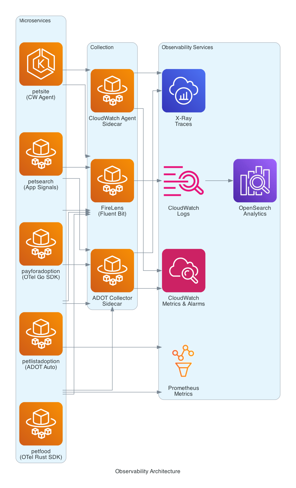

# Observability Patterns

Each microservice demonstrates a different observability instrumentation strategy, giving workshop participants hands-on experience with the full spectrum of AWS observability tools.

## Distributed Tracing

| Service | Approach | Details |
|---------|----------|---------|
| `payforadoption-go` | OpenTelemetry Go SDK | CloudWatch agent sidecar (OTLP mode) |
| `petlistadoptions-py` | ADOT auto-instrumentation | CloudWatch agent sidecar (manual config for FastAPI) |
| `petsearch-java` | Application Signals | L2 construct with auto + manual instrumentation, SLO definitions |
| `petsite-net` | CloudWatch agent | Application Signals on EKS (managed node group) |
| `petfood-rs` | OpenTelemetry Rust SDK | Custom Prometheus metrics |

## Log Routing

- **FireLens** (Fluent Bit) sidecar on ECS tasks routes logs to OpenSearch (optional, requires `ENABLE_OPENSEARCH=true`)
- **Container Insights** on ECS and EKS clusters for infrastructure metrics
- **OpenSearch** ingestion pipeline for centralized log analytics

## Metrics

- CloudWatch metrics from all services
- Prometheus metrics exposed by `petfood-rs` and `petlistadoptions-py`
- Application Signals SLOs on `petsearch-java`

## Instrumentation by Service

### payforadoption-go

Uses the OpenTelemetry Go SDK with a CloudWatch agent sidecar in OTLP mode. Traces are exported via OTLP to the agent, which forwards them to X-Ray. This demonstrates manual SDK instrumentation in Go with custom SQL span processing for Aurora correlation.

### petlistadoptions-py

Uses ADOT auto-instrumentation via a CloudWatch agent sidecar. The Python/FastAPI application is instrumented without code changes, though manual configuration is required for FastAPI framework support.

### petsearch-java

Uses the `ApplicationSignalsIntegration` L2 CDK construct for Application Signals. Combines auto-instrumentation with manual span creation and includes SLO definitions for monitoring service-level objectives.

### petsite-net

Deployed on EKS with a CloudWatch agent providing Application Signals. The .NET application runs behind CloudFront with both regional and global WAF protection.

### petfood-rs

Uses the OpenTelemetry Rust SDK with custom Prometheus metrics. Demonstrates manual instrumentation in Rust with both trace and metric signal types.

### waggle-ai-agents

Five agents on Bedrock AgentCore — a Strands orchestrator over LangGraph, CrewAI, LlamaIndex and OpenAI-Agents sub-agents. Each is auto-instrumented by the matching ADOT instrumentor, so one trace spans several agent frameworks.
