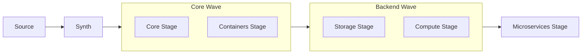
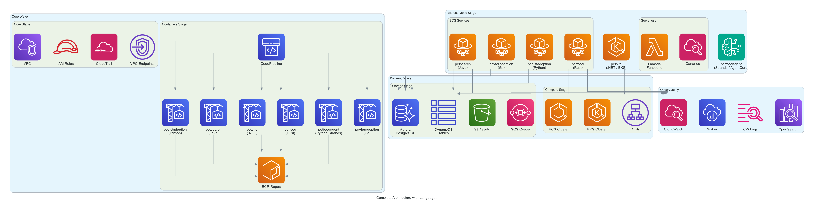
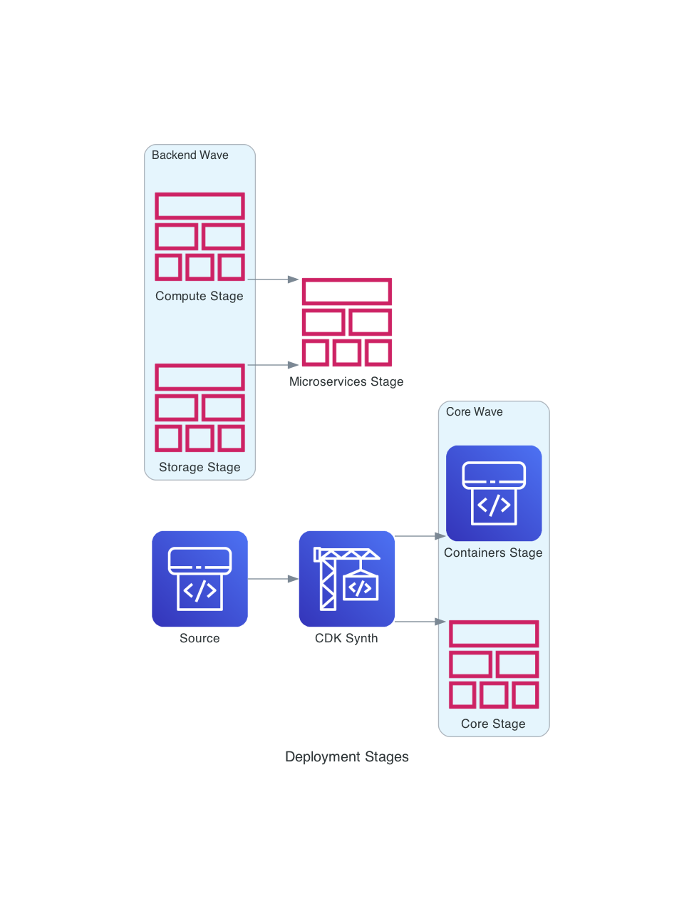

# Architecture Overview

The One Observability Demo is deployed using AWS CDK with a multi-stage pipeline architecture. The infrastructure is organized into five deployment stages across two waves, plus a standalone microservices stage.

## CDK Pipeline Architecture

### Wave Execution

1. **Core Wave** executes first:
    - **Core Stage** — Networking, security, observability infrastructure
    - **Containers Stage** — Builds container images for all 6 microservices via CodePipeline

2. **Backend Wave** executes after Core Wave:
    - **Storage Stage** — Databases, queues, object storage (with post-deployment DynamoDB and RDS seeding)
    - **Compute Stage** — ECS cluster, EKS cluster, load balancers

3. **Microservices Stage** executes last:
    - Deploys all 6 microservices, Lambda functions, canaries, and WAF associations

## Architecture Diagrams

### Complete Architecture

### Deployment Stages

### Microservices Runtime

## Security

- **VPC Isolation** — Private subnets for all compute, VPC endpoints for AWS API calls
- **IAM Least Privilege** — Per-service task roles with minimal permissions
- **Encryption** — S3 SSE, DynamoDB encryption at rest, Aurora encryption
- **WAF** — Regional and global web ACLs
- **CDK Nag** — Automated security compliance checking

## Configuration

The pipeline supports two source modes:

- **CodeConnection** (GitHub) — Set `codeConnectionArn` for direct repository integration
- **S3 Bucket** — Fallback mode using `configBucketName` for source code zip

Configuration parameters can be stored in SSM Parameter Store and retrieved during synthesis via `retrieve-config.sh`.
