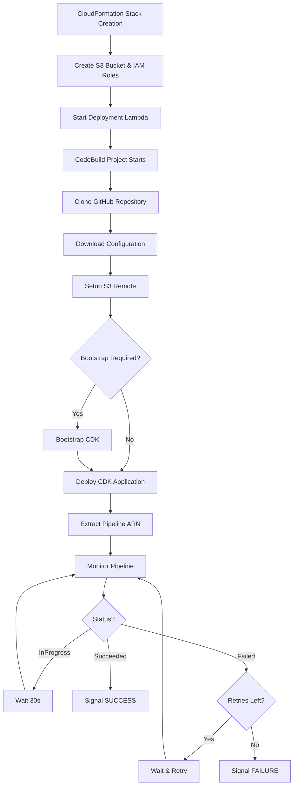

# CodeBuild CDK Deployment Template

This CloudFormation template automates the deployment of AWS CDK projects for workshop environments. It provides a simplified, robust solution for bootstrapping AWS accounts, deploying CDK applications, and monitoring pipeline executions with intelligent retry handling.

## Overview

The template creates:

- **S3 bucket** for configuration storage and CodePipeline source
- **CodeBuild project** for CDK deployment orchestration with local caching
- **Lambda functions** for deployment initiation and resource cleanup
- **IAM roles** with appropriate permissions
- **Wait conditions** for CloudFormation synchronization
- **Intelligent pipeline monitoring** with retry support

## Deployment Flow



## Parameters

| Parameter | Description | Default |
|-----------|-------------|---------|
| `pConfigFileUrl` | URL to initial configuration file | `https://raw.githubusercontent.com/.../default.env` |
| `pOrganizationName` | GitHub organization name | `aws-samples` |
| `pRepositoryName` | Repository containing CDK code | `one-observability-demo` |
| `pBranchName` | Branch to deploy from | `main` |
| `pCodeConnectionArn` | Optional CodeConnection ARN for GitHub | _(empty)_ |
| `pWorkingFolder` | Working folder for deployment | `src/cdk` |
| `pApplicationName` | Application name for tagging | `One Observability Workshop` |
| `pDisableCleanup` | Disable cleanup on failure | `false` |
| `pCDKStackName` | CDK stack name for outputs | `Microservices-Microservice` |
| `pParameterStoreBasePath` | Base path in Parameter Store | `/petstore` |
| `pWaitForDeployment` | Wait for pipeline completion | `true` |
| `pVpcCidr` | CIDR block for VPC | `10.0.0.0/16` |
| `pUserDefinedTagKey1-5` | Custom tag keys | _(various)_ |
| `pUserDefinedTagValue1-5` | Custom tag values | _(various)_ |

## Retry Handling

The system automatically detects and handles retries:

- **Manual Retries** — User manually retries failed pipeline execution
- **Automatic Retries** — Pipeline configured with automatic retry policies
- **Superseded Executions** — New execution starts while previous is running
- **Partial Failures** — Individual stage failures with stage-level retries

Configuration:

- Maximum retries: 3 attempts
- Retry wait time: 60 seconds
- Overall timeout: 1 hour (3600 seconds)
- Polling interval: 30 seconds

## Build Phases

### 1. Install

```bash
npm install -g aws-cdk
pip3 install git-remote-s3
```

### 2. Pre-Build

- Clone repository from GitHub
- Download and merge configuration
- Setup S3 remote for CodePipeline source
- Bootstrap CDK (with intelligent status checking)

### 3. Build

```bash
cd $WORKING_FOLDER
npm install
cdk deploy --require-approval never --outputs-file cdk-outputs.json
```

### 4. Pipeline Monitoring

- Execution ID tracking for retry detection
- Status-specific handling for all pipeline states
- Progress reporting every 5 minutes
- Detailed error information on failures

## Outputs

| Output | Description |
|--------|-------------|
| `oConfigBucketName` | S3 bucket name for configuration storage |
| `oCodeBuildProjectName` | CodeBuild project name |
| `oDeploymentStatus` | Deployment status information |
| `oRepositoryInfo` | Repository configuration details |

## Troubleshooting

!!! tip "Manual Pipeline Fixes"
    If you need to manually fix pipeline issues and want the CloudFormation stack to complete:
    ```bash
    aws cloudformation update-stack \
      --stack-name {StackName} \
      --use-previous-template \
      --parameters ParameterKey=pWaitForDeployment,ParameterValue=false \
      --capabilities CAPABILITY_NAMED_IAM
    ```

### Debug Commands

```bash
# Check CodeBuild project status
aws codebuild batch-get-projects --names {StackName}-cdk-deployment

# View recent builds
aws codebuild list-builds-for-project --project-name {StackName}-cdk-deployment

# Check pipeline status
aws codepipeline get-pipeline-state --name {PipelineName}
```
