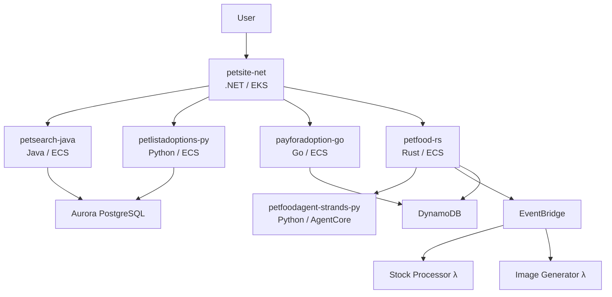

# Microservices Overview

The One Observability Demo deploys 6 microservices, each written in a different language and using a different observability instrumentation strategy.

## Service Map

## Services at a Glance

| Service | Language | Platform | Observability | Description |
|---------|----------|----------|---------------|-------------|
| [`payforadoption-go`](payforadoption-go.md) | Go | ECS Fargate | OTel Go SDK + ADOT sidecar | Payment processing |
| [`petsearch-java`](petsearch-java.md) | Java/Spring Boot | ECS Fargate | Application Signals | Pet search |
| [`petlistadoptions-py`](petlistadoptions-py.md) | Python/FastAPI | ECS Fargate | ADOT auto-instrumentation | Pet listing and adoptions |
| [`petsite-net`](petsite-net.md) | .NET | EKS Fargate | CloudWatch agent | Web frontend |
| [`petfood-rs`](petfood-rs.md) | Rust/Axum | ECS Fargate | OTel Rust SDK + Prometheus | Food catalog and cart |
| [`petfoodagent-strands-py`](petfoodagent-strands-py.md) | Python/Strands | Bedrock AgentCore | AI agent | Food recommendations |

## Container Build Pipeline

All 6 services are built in parallel during the Containers Stage using a dedicated CodePipeline:

1. **Source** — Retrieves source from S3 bucket or CodeConnection (GitHub)
2. **Build** — Parallel container builds for all services, pushed to ECR
