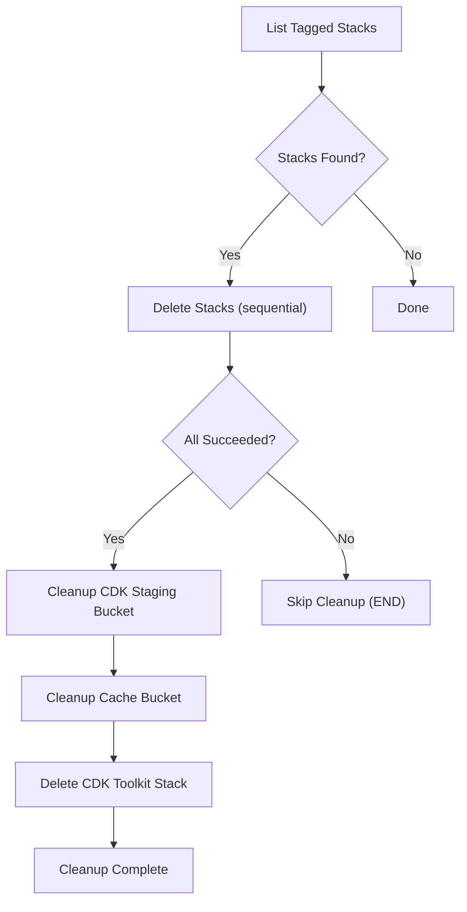

# CDK Stack Cleanup

Automated cleanup mechanism using Step Functions with async polling for reliable deletion of CDK stacks, S3 buckets, and bootstrap resources.

## Problem Solved

- **Timeout Limitations** — Original Lambda approach had 15-minute timeout, insufficient for EKS/Aurora (30+ minutes)
- **Orphaned Resources** — Failed cleanups would delete the cleanup mechanism itself
- **Silent Failures** — Stack deletion could complete even if cleanup failed

## Architecture



## Execution Workflows

### Successful Cleanup

1. CloudFormation stack deletion initiated
2. Custom resource starts Step Function
3. CDK stacks listed and deleted sequentially
4. All deletions succeed → cleanup S3 buckets and bootstrap stack
5. Cleanup completion function removes all retained resources
6. No resources left behind

### Failed Cleanup

1. One or more stack deletions fail
2. Step Function skips cleanup steps
3. CloudFormation stack deletion fails (`DELETE_FAILED`)
4. All cleanup resources preserved for retry

### Retry After Failure

1. Investigate Step Function execution history
2. Manually resolve the issue
3. Delete the CloudFormation stack again
4. Step Function automatically retries

## Key Features

- **No timeout limits** — Step Functions can run up to 1 year
- **Failure detection** — Cleanup only proceeds if ALL deletions succeed
- **Retry capability** — Failed cleanups preserve all resources for retry
- **Complete cleanup** — On success, all Lambda functions, IAM roles, EventBridge rules, and the state machine itself are deleted

## Triggers

- **Stack Deletion** — EventBridge rule monitors `DELETE_IN_PROGRESS` status
- **CodeBuild Failure** — EventBridge rule monitors `FAILED`, `FAULT`, `STOPPED`, `TIMED_OUT`

## Troubleshooting

!!! tip "CDK Bootstrap Stack Deleted Prematurely"
    If the bootstrap stack is removed before cleanup completes, re-bootstrap from CloudShell:
    ```bash
    export AWS_ACCOUNT_ID=$(aws sts get-caller-identity --query Account --output text)
    cdk bootstrap aws://${AWS_ACCOUNT_ID}/${AWS_REGION} \
      --toolkit-stack-name CDKToolkitPetsite --qualifier petsite
    ```
