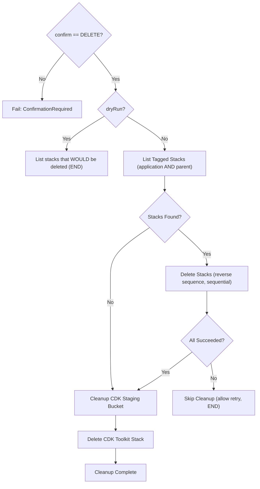

# CDK Stack Cleanup (standalone teardown)

Teardown of the CDK-pipeline-created stacks is handled by a **standalone, opt-in**
CloudFormation template, `src/templates/teardown-stepfunction.yaml`. It is
deployed separately from the deploy bootstrapper and is **never triggered
automatically** (see [ADR-0001](../architecture/decisions/0001-deployment-template-split-and-safer-teardown.md)).

## Why it exists

The deploy bootstrapper does not create the application infrastructure itself; it
launches a self-mutating CDK pipeline that does. From CloudFormation's point of
view the resulting `Core`/`Backend`/`Microservices` stacks, the `CDKToolkitPetsite`
bootstrap stack, the `cdk-petsite-assets-*` bucket, and the
`cdk-petsite-container-assets-*` ECR repo are orphans it cannot delete. This Step
Function discovers those stacks by tag and deletes them in the right order.

## Why it is opt-in (not automatic)

Previously the cleanup state machine was embedded in the deploy template and
triggered automatically from the CodeBuild failure path, a stack-rollback custom
resource, and an EventBridge `DELETE_IN_PROGRESS` rule. That coupled "the deploy
timed out being watched" to "destroy the whole environment", so a healthy-but-slow
deploy could be torn down (the 2026-09-14 RCA). All of those automatic triggers
have been removed. Teardown is now an explicit operator action with a confirmation
token and a dry-run preview.

## Architecture


```mermaid
flowchart TD
    Confirm{"confirm == DELETE?"} -->|No| Fail["Fail: ConfirmationRequired"]
    Confirm -->|Yes| Dry{"dryRun?"}
    Dry -->|Yes| Preview["List stacks that WOULD be deleted (END)"]
    Dry -->|No| List["List Tagged Stacks (application AND parent)"]
    List --> Check{"Stacks Found?"}
    Check -->|Yes| Delete["Delete Stacks (reverse sequence, sequential)"]
    Check -->|No| Staging["Cleanup CDK Staging Bucket"]
    Delete --> Eval{"All Succeeded?"}
    Eval -->|Yes| Staging
    Eval -->|No| Skip["Skip Cleanup (allow retry, END)"]
    Staging --> Toolkit["Delete CDK Toolkit Stack"]
    Toolkit --> Complete["Cleanup Complete"]
```

## Deploy and run

```bash
# 1. Deploy the teardown stack (parameterized to one deployment)
aws cloudformation create-stack \
  --stack-name OneObservability-Teardown \
  --template-body file://src/templates/teardown-stepfunction.yaml \
  --capabilities CAPABILITY_IAM \
  --parameters \
    ParameterKey=pApplicationName,ParameterValue="One Observability Workshop" \
    ParameterKey=pParentStackName,ParameterValue=<your deploy stack name>

# 2. Preview what WOULD be deleted (deletes nothing)
aws stepfunctions start-execution \
  --state-machine-arn <StateMachineArn output> \
  --input '{"confirm":"DELETE","dryRun":true}'

# 3. Perform the teardown
aws stepfunctions start-execution \
  --state-machine-arn <StateMachineArn output> \
  --input '{"confirm":"DELETE"}'
```

The `oDryRunCommand` and `oTeardownCommand` stack outputs print these commands
with the ARN already filled in.

## Guard rails

- **Confirmation required** — the state machine fails immediately unless started
  with `{"confirm":"DELETE"}`. An accidental or empty invocation is a no-op.
- **Dry-run** — `{"confirm":"DELETE","dryRun":true}` lists the stacks that would
  be deleted, in order, and deletes nothing.
- **Two-tag scoping** — only stacks carrying BOTH `application=<pApplicationName>`
  AND `parent=<pParentStackName>` are deleted, so concurrent workshops in one
  account cannot delete each other's stacks. The IAM `DeleteStack` permission is
  conditioned on both tags as well.
- **Reverse-sequence, fail-safe deletion** — stacks are deleted highest
  `sequence` first; if any stack fails to delete, bootstrap cleanup is skipped so
  the deployment can be retried.

## Key features

- **No timeout limits** — Step Functions can run far longer than a Lambda, enough
  for EKS/Aurora teardown (30+ minutes).
- **Failure detection** — bootstrap cleanup only proceeds if ALL stack deletions
  succeed.
- **Self-contained** — deleting the teardown CloudFormation stack removes the
  state machine and its Lambdas/roles.

## Troubleshooting

!!! tip "CDK Bootstrap Stack Deleted Prematurely"
    If the bootstrap stack is removed before cleanup completes, re-bootstrap from CloudShell:
    ```bash
    export AWS_ACCOUNT_ID=$(aws sts get-caller-identity --query Account --output text)
    cdk bootstrap aws://${AWS_ACCOUNT_ID}/${AWS_REGION} \
      --toolkit-stack-name CDKToolkitPetsite --qualifier petsite
    ```
