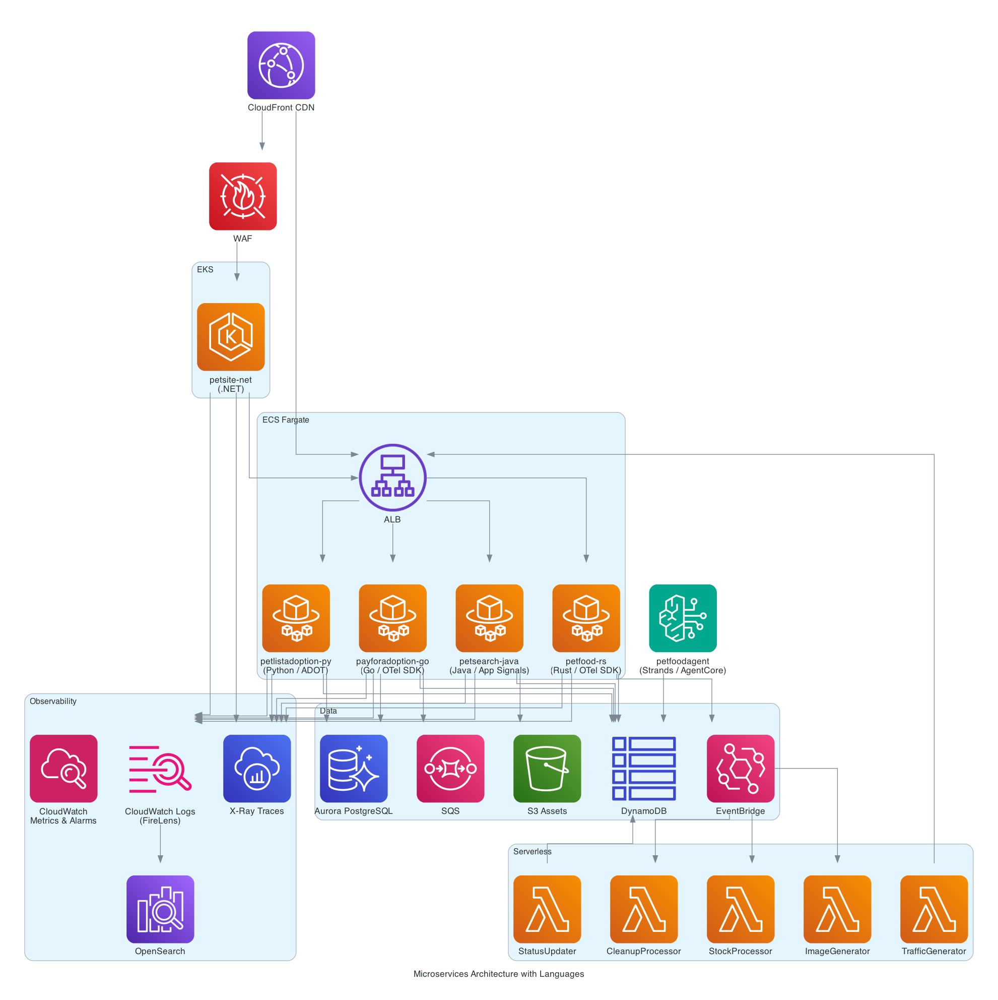
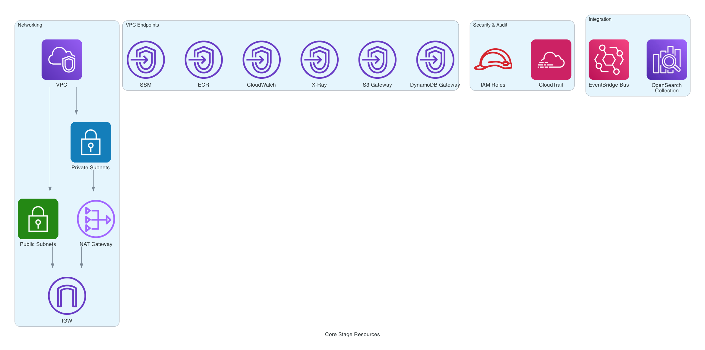
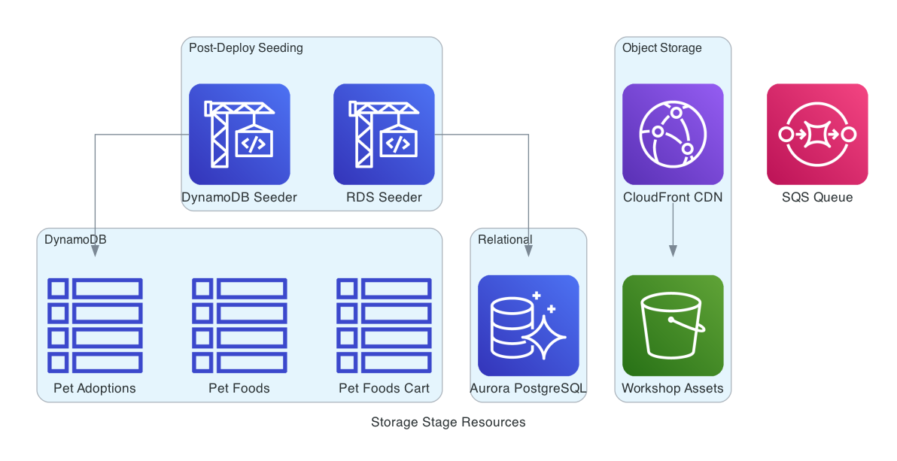
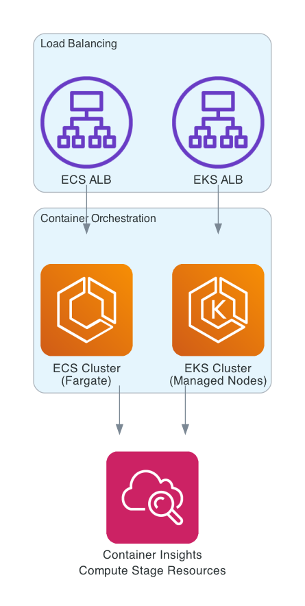
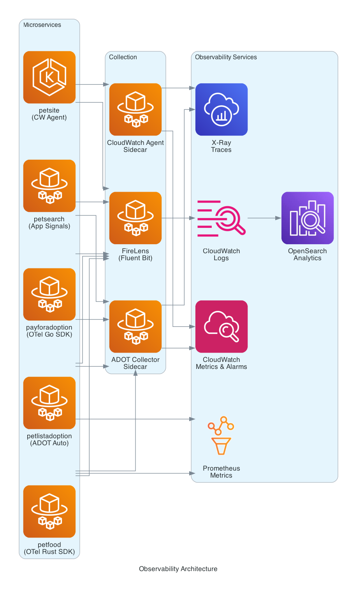

<!--
Copyright Amazon.com, Inc. or its affiliates. All Rights Reserved.
SPDX-License-Identifier: Apache-2.0
-->
# One Observability Demo - Infrastructure Architecture

## Overview

The One Observability Demo is deployed using AWS CDK with a multi-stage pipeline architecture. The infrastructure is organized into five deployment stages across two waves, plus a standalone microservices stage, creating a comprehensive observability platform for demonstrating AWS monitoring and observability services.

## CDK Pipeline Architecture

The deployment follows a CDK Pipelines pattern orchestrated by the `CDKPipeline` class.

### Pipeline Structure

```
Source → Synth → Core Wave → Backend Wave → Microservices Stage
                    ↓             ↓                ↓
              [Core Stage]   [Storage Stage]   [Microservices]
              [Containers]   [Compute Stage]
```

### Wave Execution

1. **Core Wave** executes first:
   - **Core Stage** — Networking, security, observability infrastructure
   - **Containers Stage** — Builds container images for all 6 microservices via CodePipeline

2. **Backend Wave** executes after Core Wave:
   - **Storage Stage** — Databases, queues, object storage (with post-deployment DynamoDB and RDS seeding steps)
   - **Compute Stage** — ECS cluster, EKS cluster, load balancers

3. **Microservices Stage** executes last (standalone `pipeline.addStage()`):
   - Deploys all 6 microservices, Lambda functions, canaries, and WAF associations

### Stage Dependencies

- **Containers Stage** depends on Core Stage for networking
- **Storage Stage** depends on Core Stage for VPC
- **Compute Stage** depends on Core Stage for VPC and security groups
- **Microservices Stage** depends on all previous stages — imports ECS/EKS clusters, databases, queues, and container images via CloudFormation exports

## Deployment Stages

### 1. Core Stage

Deploys foundational infrastructure required by all other stages.

**Resources**:
- VPC with public/private subnets, NAT gateways
- VPC Endpoints for private AWS service connectivity (SSM, ECR, CloudWatch, X-Ray, STS, EventBridge, S3, DynamoDB)
- Security groups and IAM roles
- CloudTrail audit logging
- EventBridge event bus
- OpenSearch Serverless collection and ingestion pipeline

### 2. Containers Stage

Builds and pushes container images for all microservices using a dedicated CodePipeline.

**Microservices Built** (6 applications):

| Service | Language | Host | Architecture | Notes |
|---------|----------|------|-------------|-------|
| `payforadoption-go` | Go | ECS Fargate | AMD64 | Payment processing with OpenTelemetry Go SDK |
| `petlistadoption-py` | Python/FastAPI | ECS Fargate | AMD64 | Pet listing with ADOT auto-instrumentation |
| `petsearch-java` | Java/Spring Boot | ECS Fargate | AMD64 | Pet search with Application Signals |
| `petsite-net` | .NET | EKS Fargate | AMD64 | Web frontend with CloudWatch agent |
| `petfood-rs` | Rust/Axum | ECS Fargate | AMD64 | Food catalog with OpenTelemetry Rust SDK |
| `petfoodagent-strands-py` | Python/Strands | Bedrock AgentCore | ARM64 | AI agent (container built but not deployed to ECS/EKS) |

**Pipeline Architecture**:
1. **Source Stage** — Retrieves source from S3 bucket or CodeConnection (GitHub)
2. **Build Stage** — Parallel container builds for all 6 microservices

### 3. Storage Stage

Deploys data persistence and messaging resources.

**Resources**:
- **Amazon DynamoDB** — Pet adoption table, pet foods table, pet foods cart table
- **Amazon Aurora PostgreSQL** — Relational database for structured data
- **Amazon S3** — Workshop assets bucket with pre-populated pet images, CloudFront distribution for CDN
- **Amazon SQS** — Message queue for decoupled communication
- **Workshop Assets** — S3 seeding with demo images

**Post-deployment steps**: DynamoDB seeding and RDS seeding run as CodeBuild steps after the stage deploys.

### 4. Compute Stage

Deploys container orchestration platforms.

**Resources**:
- **Amazon ECS** — Fargate cluster for microservice tasks
- **Amazon EKS** — Kubernetes cluster with managed node groups
- **Application Load Balancers** — Traffic distribution for ECS and EKS services
- **Container Insights** — Enabled on both ECS and EKS clusters

**Note**: Lambda functions and microservice task definitions are deployed in the Microservices Stage, not here. This stage only creates the clusters and load balancers.

### 5. Microservices Stage

Deploys all microservices, serverless functions, canaries, and WAF rules. This is a standalone `pipeline.addStage()` call (not inside a wave).

**Microservices** (see table above for details):
- 4 ECS services: payforadoption-go, petlistadoption-py, petsearch-java, petfood-rs
- 1 EKS deployment: petsite-net (with CloudFront distribution and WAF)
- 1 Bedrock AgentCore deployment: petfoodagent-strands-py

**Lambda Functions**:
- **StatusUpdater** (Node.js) — Updates pet adoption status in DynamoDB
- **UserCreator** (Node.js) — Creates Cognito users for the workshop
- **RdsSeeder** (Node.js) — Seeds Aurora PostgreSQL with initial data
- **TrafficGenerator** (Node.js) — Generates synthetic traffic for observability demos
- **PetfoodStockProcessor** (Node.js) — Processes food stock events from EventBridge
- **PetfoodImageGenerator** (Node.js) — Generates pet food images via Bedrock
- **PetfoodCleanupProcessor** (Node.js) — Cleans up expired food listings

**Canaries**:
- **TrafficGeneratorCanary** — CloudWatch Synthetics canary for continuous traffic
- **HousekeepingCanary** — Periodic cleanup of stale resources

**WAF**:
- Regional WAF on ALB
- Global WAF on CloudFront (optional, controlled by feature flag)

## Observability Architecture

Each microservice demonstrates different observability patterns:

### Distributed Tracing
- **payforadoption-go** — OpenTelemetry Go SDK with ADOT collector sidecar
- **petlistadoption-py** — ADOT auto-instrumentation via CloudWatch agent sidecar (manual config required for FastAPI)
- **petsearch-java** — Application Signals L2 construct (`ApplicationSignalsIntegration`) with auto + manual instrumentation
- **petsite-net** — CloudWatch agent with Application Signals on EKS
- **petfood-rs** — OpenTelemetry Rust SDK with custom Prometheus metrics

### Log Routing
- **FireLens** (Fluent Bit) sidecar on ECS tasks routes logs to CloudWatch Logs
- **Container Insights** on ECS and EKS clusters for infrastructure metrics
- **OpenSearch** ingestion pipeline for centralized log analytics

### Metrics
- CloudWatch metrics from all services
- Prometheus metrics exposed by petfood-rs and petlistadoption-py
- Application Signals SLOs on petsearch-java

## Security

- **VPC Isolation** — Private subnets for all compute, VPC endpoints for AWS API calls
- **IAM Least Privilege** — Per-service task roles with minimal permissions
- **Encryption** — S3 SSE, DynamoDB encryption at rest, Aurora encryption
- **WAF** — Regional and global web ACLs
- **CDK Nag** — Automated security compliance checking with documented suppressions (see `.ash/.ash.yaml` for rationale)

## Configuration

The pipeline supports two source modes:
- **CodeConnection** (GitHub) — Set `codeConnectionArn` for direct repository integration
- **S3 Bucket** — Fallback mode using `configBucketName` for source code zip

Configuration parameters can be stored in SSM Parameter Store and retrieved during synthesis via `retrieve-config.sh`.

## Architecture Diagrams

### Complete Architecture Overview


### Deployment Stages Flow


### Microservices Runtime Architecture


### Stage-Specific Resources

#### Core Stage


#### Storage Stage


#### Compute Stage


#### Observability Stack

