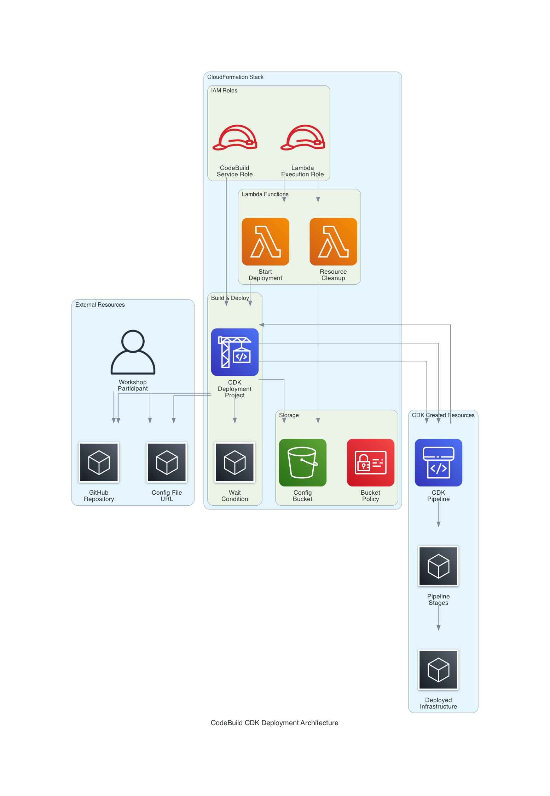
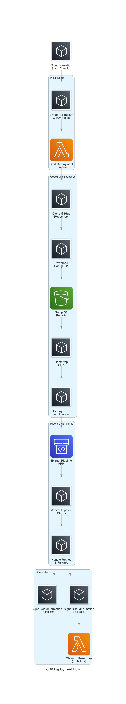
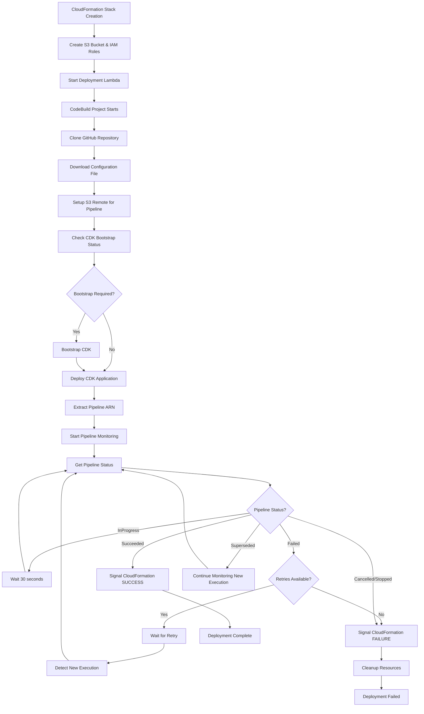

<!--
Copyright Amazon.com, Inc. or its affiliates. All Rights Reserved.
SPDX-License-Identifier: Apache-2.0
-->
# CodeBuild CDK Deployment Template

This CloudFormation template automates the deployment of AWS Cloud Development Kit (CDK) projects for workshop environments. It provides a simplified, robust solution for bootstrapping AWS accounts, deploying CDK applications, and monitoring pipeline executions with intelligent retry handling.

## Table of Contents

- [Overview](#overview)
- [Architecture](#architecture)
- [Deployment Flow](#deployment-flow)
- [Key Features](#key-features)
- [Usage](#usage)
- [Parameters](#parameters)
- [Implementation Details](#implementation-details)
- [Retry Handling](#retry-handling)
- [Monitoring and Debugging](#monitoring-and-debugging)
- [Troubleshooting](#troubleshooting)
- [Security Considerations](#security-considerations)

## Overview

This template creates a complete infrastructure for automated CDK deployments, including:

- **S3 bucket** for configuration storage and CodePipeline source
- **CodeBuild project** for CDK deployment orchestration
- **Lambda functions** for deployment initiation and resource cleanup
- **IAM roles** with appropriate permissions
- **Wait conditions** for CloudFormation synchronization
- **Intelligent pipeline monitoring** with retry support

## Architecture



The architecture consists of several key components:

1. **External Resources**: GitHub repository and configuration files
2. **CloudFormation Stack**: Core infrastructure components
3. **CDK Created Resources**: Pipeline and deployed infrastructure

## Deployment Flow



The deployment follows this detailed flow:



## Key Features

### 🚀 **Simplified Architecture**
- Removed complex EventBridge rules and custom resources
- Direct pipeline status polling for reliability
- Streamlined resource management

### 🔄 **Intelligent Retry Handling**
- Automatic detection of pipeline retries
- Configurable retry limits (default: 3 attempts)
- Graceful handling of superseded executions

### ⏱️ **Extended Timeout Support**
- 1-hour timeout for complex deployments (EKS, RDS, etc.)
- 30-second polling intervals for responsive monitoring
- Progress reports every 5 minutes

### 🛡️ **Robust Error Handling**
- Comprehensive status checking
- Detailed error reporting and debugging information
- Automatic resource cleanup on failures
- Fixed pipeline name extraction from ARN using correct field delimiter

### 📊 **Enhanced Monitoring**
- Real-time pipeline status updates
- Detailed stage-level information
- Comprehensive logging for troubleshooting

## Usage

### Basic Deployment

```bash
aws cloudformation create-stack \
  --stack-name MyWorkshop-CDK-Deployment \
  --template-body file://codebuild-deployment-template.yaml \
  --capabilities CAPABILITY_NAMED_IAM \
  --parameters \
    ParameterKey=pOrganizationName,ParameterValue=my-org \
    ParameterKey=pRepositoryName,ParameterValue=my-cdk-project \
    ParameterKey=pBranchName,ParameterValue=main \
    ParameterKey=pWorkingFolder,ParameterValue=src/cdk
```

### With Custom Configuration

```bash
aws cloudformation create-stack \
  --stack-name MyWorkshop-CDK-Deployment \
  --template-body file://codebuild-deployment-template.yaml \
  --capabilities CAPABILITY_NAMED_IAM \
  --parameters \
    ParameterKey=pConfigFileUrl,ParameterValue=https://example.com/config.json \
    ParameterKey=pOrganizationName,ParameterValue=aws-samples \
    ParameterKey=pRepositoryName,ParameterValue=one-observability-demo \
    ParameterKey=pBranchName,ParameterValue=feat/cdkpipeline \
    ParameterKey=pWorkingFolder,ParameterValue=src/cdk \
    ParameterKey=pUserDefinedTagKey1,ParameterValue=Environment \
    ParameterKey=pUserDefinedTagValue1,ParameterValue=Workshop
```

## Parameters

| Parameter | Description | Default | Required |
|-----------|-------------|---------|----------|
| `pConfigFileUrl` | URL to the initial configuration file | `https://raw.githubusercontent.com/aws-samples/one-observability-demo/refs/heads/feat/cdkpipeline/typedoc.json` | Yes |
| `pOrganizationName` | GitHub/CodeCommit organization name | `aws-samples` | Yes |
| `pRepositoryName` | Repository containing the CDK code | `one-observability-demo` | Yes |
| `pBranchName` | Branch to deploy from | `feat/cdkpipeline` | Yes |
| `pWorkingFolder` | Working folder for deployment | `src/cdk` | Yes |
| `pUserDefinedTagKey1-5` | Custom tag keys for resource tagging | Various | No |
| `pUserDefinedTagValue1-5` | Custom tag values for resource tagging | Various | No |

## Implementation Details

### CodeBuild Project Configuration

The CodeBuild project uses:
- **Runtime**: Amazon Linux 2 with Node.js 22 and Python 3.12
- **Compute**: `BUILD_GENERAL1_SMALL` (sufficient for most CDK deployments)
- **Privileged Mode**: Enabled for Docker operations
- **Timeout**: 60 minutes (CloudFormation level)

### Build Phases

#### 1. **Install Phase**
```bash
# Install required tools
npm install -g aws-cdk
pip3 install git-remote-s3
```

#### 2. **Pre-Build Phase**
```bash
# Configure Git and clone repository
git config --global user.email "codebuild@aws.amazon.com"
git config --global user.name "AWS CodeBuild"
git clone --depth 1 --branch $BRANCH_NAME https://github.com/$ORGANIZATION_NAME/$REPOSITORY_NAME.git ./repo

# Download configuration and setup S3 remote
curl -o ./config.json "$CONFIG_FILE_URL"
git remote add s3 s3+zip://$CONFIG_BUCKET/repo
git push s3 $BRANCH_NAME

# Handle CDK bootstrapping
if ! aws cloudformation describe-stacks --stack-name CDKToolkit > /dev/null 2>&1; then
  cdk bootstrap
fi
```

#### 3. **Build Phase**
```bash
# Deploy CDK application
cd $WORKING_FOLDER
npm install
cdk deploy --require-approval never --outputs-file cdk-outputs.json

# Extract pipeline information
PIPELINE_ARN=$(cat cdk-outputs.json | jq -r '.[] | select(has("PipelineArn")) | .PipelineArn')
PIPELINE_NAME=$(echo $PIPELINE_ARN | cut -d':' -f6)
```

#### 4. **Pipeline Monitoring**
The template implements sophisticated pipeline monitoring with:
- **Execution ID tracking** for retry detection
- **Configurable retry limits** (default: 3 attempts)
- **Status-specific handling** for all pipeline states
- **Progress reporting** every 5 minutes
- **Detailed error information** on failures
- **Corrected pipeline name extraction** using ARN field 6 instead of path segment 2

## Retry Handling

### Automatic Retry Detection

The system automatically detects retries by monitoring pipeline execution IDs:

```bash
# Get the initial execution ID to track retries
INITIAL_EXECUTION_ID=$(aws codepipeline list-pipeline-executions \
  --pipeline-name "$PIPELINE_NAME" \
  --max-items 1 \
  --query 'pipelineExecutionSummaries[0].pipelineExecutionId' \
  --output text)

# Check if this is a new execution (retry scenario)
if [ "$CURRENT_EXECUTION_ID" != "$INITIAL_EXECUTION_ID" ]; then
  RETRY_COUNT=$((RETRY_COUNT + 1))
  echo "Detected new pipeline execution (retry #$RETRY_COUNT): $CURRENT_EXECUTION_ID"
fi
```

### Retry Scenarios Handled

1. **Manual Retries**: User manually retries failed pipeline execution
2. **Automatic Retries**: Pipeline configured with automatic retry policies
3. **Superseded Executions**: New execution starts while previous is running
4. **Partial Failures**: Individual stage failures with stage-level retries
5. **Timeout Scenarios**: Long-running deployments that exceed estimates

### Configuration

- **Maximum Retries**: 3 attempts (configurable via `MAX_RETRIES` variable)
- **Retry Wait Time**: 60 seconds for failed executions
- **Overall Timeout**: 1 hour (3600 seconds)
- **Polling Interval**: 30 seconds

## Monitoring and Debugging

### Real-time Status Updates

The system provides comprehensive monitoring:

```bash
# Current status logging
echo "Current pipeline execution status: $EXECUTION_STATUS (ID: $CURRENT_EXECUTION_ID)"

# Progress reports every 5 minutes
if [ $ELAPSED -gt 0 ] && [ $((ELAPSED % 300)) -eq 0 ]; then
  echo "Progress check: $((ELAPSED / 60)) minutes elapsed, status: $EXECUTION_STATUS"

  # Detailed stage information
  aws codepipeline get-pipeline-state \
    --name "$PIPELINE_NAME" \
    --query 'stageStates[*].[stageName,latestExecution.status]' \
    --output table
fi
```

### Error Information

On timeout or failure, the system provides:
- Final pipeline status
- Total retry attempts
- Detailed stage states
- Error messages from failed stages

### CloudWatch Logs

All CodeBuild execution logs are available in CloudWatch Logs under:
- Log Group: `/aws/codebuild/{StackName}-cdk-deployment`
- Log Stream: Individual build execution streams

## Troubleshooting

### Common Issues

#### 1. **CDK Bootstrap Failures**
```bash
# The template handles bootstrap issues automatically
if [ "$STACK_STATUS" = "ROLLBACK_COMPLETE" ]; then
  echo "CDK bootstrap stack in ROLLBACK_COMPLETE state, cleaning up resources..."
  # Cleanup and re-bootstrap
fi
```

#### 2. **Pipeline Not Found**
- Verify CDK deployment succeeded
- Check `cdk-outputs.json` for `PipelineArn`
- Ensure CDK stack exports pipeline ARN

#### 3. **Timeout Issues**
- Increase timeout for complex deployments
- Check individual stage execution times
- Consider breaking large deployments into smaller stacks

#### 4. **Permission Issues**
- Verify CodeBuild service role has `AdministratorAccess`
- Check S3 bucket policies
- Ensure proper IAM role trust relationships

### Debug Commands

```bash
# Check CodeBuild project status
aws codebuild batch-get-projects --names {StackName}-cdk-deployment

# View recent build executions
aws codebuild list-builds-for-project --project-name {StackName}-cdk-deployment

# Get detailed build information
aws codebuild batch-get-builds --ids {BuildId}

# Check pipeline status
aws codepipeline get-pipeline-state --name {PipelineName}

# List recent pipeline executions
aws codepipeline list-pipeline-executions --pipeline-name {PipelineName}
```

## Security Considerations

### IAM Permissions

The template uses `AdministratorAccess` for simplicity in workshop environments. For production use, consider:

1. **Principle of Least Privilege**: Create custom policies with minimal required permissions
2. **Resource-Specific Permissions**: Limit access to specific resources
3. **Condition-Based Access**: Use conditions to restrict access patterns

### S3 Security

- **Encryption**: AES256 server-side encryption enabled
- **Public Access**: Blocked via bucket public access configuration
- **HTTPS Only**: Bucket policy enforces secure transport
- **Versioning**: Enabled for configuration tracking

### Network Security

- **VPC**: CodeBuild runs in AWS-managed VPC (consider custom VPC for production)
- **Internet Access**: Required for GitHub access and package downloads
- **Egress Control**: Consider VPC endpoints for AWS service access

### Secrets Management

- **No Hardcoded Secrets**: Template avoids hardcoded credentials
- **Environment Variables**: Sensitive data passed via environment variables
- **AWS Secrets Manager**: Consider for production secret management

## Best Practices

### 1. **Resource Tagging**
Use the provided tagging parameters to maintain resource organization:
```yaml
Tags:
  - Key: Environment
    Value: Workshop
  - Key: Project
    Value: ObservabilityDemo
  - Key: Owner
    Value: TeamName
```

### 2. **Monitoring**
- Enable CloudTrail for API call auditing
- Set up CloudWatch alarms for build failures
- Use AWS Config for compliance monitoring

### 3. **Cost Management**
- Use appropriate CodeBuild compute sizes
- Clean up resources after workshops
- Monitor S3 storage costs

### 4. **Version Control**
- Tag template versions
- Maintain changelog
- Use semantic versioning

## Outputs

The template provides the following outputs:

| Output | Description | Export Name |
|--------|-------------|-------------|
| `oConfigBucketName` | S3 bucket name for configuration storage | `{StackName}-ConfigBucketName` |
| `oCodeBuildProjectName` | CodeBuild project name | `{StackName}-CodeBuildProjectName` |
| `oDeploymentStatus` | Deployment status information | `{StackName}-DeploymentStatus` |
| `oRepositoryInfo` | Repository configuration details | `{StackName}-RepositoryInfo` |

## Contributing

When contributing to this template:

1. **Test Changes**: Validate in isolated AWS account
2. **Update Documentation**: Keep README current with changes
3. **Version Control**: Use semantic versioning
4. **Security Review**: Ensure security best practices
5. **Performance Testing**: Validate with various CDK project sizes

## License

This template is licensed under the MIT-0 License. See the LICENSE file for details.

---

**Note**: This template is designed for workshop and educational environments. For production use, review and adjust security settings, permissions, and resource configurations according to your organization's requirements.
