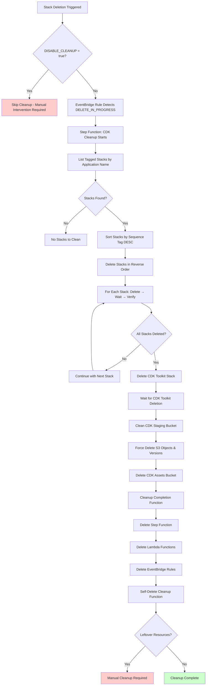

# Deployment and Cleanup Analysis

This document analyzes the resource lifecycle and cleanup process for the One Observability Demo CDK deployment.

## Resource Creation and Deletion Timeline

```mermaid
gantt
    title Resource Lifecycle in One Observability Demo
    dateFormat X
    axisFormat %s

    section CloudFormation Template
    Template Stack Creation    :active, template, 0, 30
    CodeBuild Project         :active, codebuild, 0, 30
    S3 Config Bucket         :active, s3config, 0, 30
    Lambda Functions         :active, lambdas, 0, 30
    Step Function            :active, stepfn, 0, 30
    EventBridge Rule         :active, eventbridge, 0, 30

    section CDK Bootstrap
    CDK Toolkit Stack        :active, cdktoolkit, 30, 60
    CDK Assets Bucket        :active, cdkassets, 30, 60
    ECR Repository           :active, ecr, 30, 60

    section CDK Pipeline
    Pipeline Stack           :active, pipeline, 60, 90
    Artifact Bucket          :active, artifacts, 60, 90

    section Core Stage (Seq: 1)
    VPC & Networking         :active, vpc, 90, 120
    CloudTrail               :active, cloudtrail, 90, 120
    SQS/SNS Resources        :active, queues, 90, 120
    EventBus                 :active, eventbus, 90, 120

    section Applications Stage (Seq: 2)
    ECS/EKS Clusters         :active, containers, 120, 150
    Container Images         :active, images, 120, 150

    section Storage Stage (Seq: 3)
    S3 Assets Bucket         :active, s3assets, 150, 180
    DynamoDB Tables          :active, dynamodb, 150, 180
    Aurora Database          :active, aurora, 150, 180

    section Compute Stage (Seq: 4)
    OpenSearch Collection    :active, opensearch, 180, 210
    ECS Services             :active, ecsservices, 180, 210
    EKS Workloads           :active, eksworkloads, 180, 210

    section Microservices Stage (Seq: 5)
    Microservice Apps        :active, microservices, 210, 240
    Lambda Functions         :active, lambdafns, 210, 240
    Canaries                 :active, canaries, 210, 240

    section Cleanup Process
    Step Function Execution  :crit, cleanup, 300, 330
    Stack Deletion (Seq 5-1) :crit, stackdel, 330, 390
    CDK Toolkit Cleanup      :crit, cdkcleanup, 390, 420
    Retained Resources       :crit, retained, 420, 450
```

## Cleanup Process Flow

## Resource Retention Analysis

```mermaid
graph TB
    subgraph "Resources with RemovalPolicy.DESTROY"
        A1[S3 Buckets - Pipeline Artifacts]
        A2[S3 Buckets - Config Bucket]
        A3[S3 Buckets - Assets Bucket]
        A4[DynamoDB Tables]
        A5[Aurora Database]
        A6[ECS/EKS Clusters]
        A7[Lambda Functions]
        A8[CloudWatch Log Groups]
    end

    subgraph "Resources with RemovalPolicy.RETAIN"
        B1[Step Function State Machine]
        B2[Lambda Cleanup Functions]
        B3[IAM Roles for Cleanup]
        B4[EventBridge Rules]
    end

    subgraph "Potential Leftover Resources"
        C1[CloudWatch Log Groups with Custom Retention]
        C2[ECR Repositories with Images]
        C3[S3 Bucket Objects/Versions]
        C4[IAM Roles/Policies]
        C5[Security Groups with Dependencies]
        C6[ENIs from Lambda/ECS]
        C7[CloudFormation Nested Stacks]
        C8[Parameter Store Parameters]
    end

    A1 --> D[Automatic Cleanup via CDK]
    A2 --> D
    A3 --> D
    A4 --> D
    A5 --> D
    A6 --> D
    A7 --> D
    A8 --> D

    B1 --> E[Manual Cleanup by Step Function]
    B2 --> E
    B3 --> E
    B4 --> E

    C1 --> F[Requires Manual Intervention]
    C2 --> F
    C3 --> F
    C4 --> F
    C5 --> F
    C6 --> F
    C7 --> F
    C8 --> F

    style A1 fill:#ccffcc
    style A2 fill:#ccffcc
    style A3 fill:#ccffcc
    style A4 fill:#ccffcc
    style A5 fill:#ccffcc
    style A6 fill:#ccffcc
    style A7 fill:#ccffcc
    style A8 fill:#ccffcc

    style B1 fill:#ffffcc
    style B2 fill:#ffffcc
    style B3 fill:#ffffcc
    style B4 fill:#ffffcc

    style C1 fill:#ffcccc
    style C2 fill:#ffcccc
    style C3 fill:#ffcccc
    style C4 fill:#ffcccc
    style C5 fill:#ffcccc
    style C6 fill:#ffcccc
    style C7 fill:#ffcccc
    style C8 fill:#ffcccc
```

## Identified Issues and Leftover Resources

### 1. **CloudWatch Log Groups**
- **Issue**: Some log groups may have custom retention policies and won't be automatically deleted
- **Location**: ECS tasks, Lambda functions, VPC Flow Logs
- **Solution**: Add explicit cleanup in the Step Function

### 2. **ECR Repositories**
- **Issue**: Container images in ECR repositories prevent repository deletion
- **Location**: CDK bootstrap creates `cdk-petsite-container-assets-*` repository
- **Solution**: Force delete repository with `--force` flag (already implemented)

### 3. **S3 Bucket Objects and Versions**
- **Issue**: Versioned objects and delete markers can prevent bucket deletion
- **Location**: CDK assets bucket, config bucket
- **Solution**: Enhanced cleanup to delete all versions and delete markers (partially implemented)

### 4. **Parameter Store Parameters**
- **Issue**: SSM parameters created by the application are not cleaned up
- **Location**: Parameters with prefix `/one-observability-demo/`
- **Solution**: Add parameter cleanup to Step Function

### 5. **Security Groups with Dependencies**
- **Issue**: Security groups may have dependencies that prevent deletion
- **Location**: Database security groups, ECS/EKS security groups
- **Solution**: Ensure proper dependency order in stack deletion

### 6. **Elastic Network Interfaces (ENIs)**
- **Issue**: Lambda functions and ECS tasks create ENIs that may not be immediately cleaned up
- **Location**: VPC-enabled Lambda functions, ECS tasks
- **Solution**: Add wait time for ENI cleanup before VPC deletion

### 7. **CloudFormation Nested Stacks**
- **Issue**: EKS and ECS create nested stacks that may not be properly tracked
- **Location**: EKS cluster resource provider, kubectl provider
- **Solution**: Ensure nested stacks are included in cleanup process

## Recommendations

### 1. **Enhanced Step Function Cleanup**
Add additional cleanup steps for:
- Parameter Store parameters
- CloudWatch Log Groups with custom retention
- Orphaned ENIs
- Security group dependencies

### 2. **Improved Resource Tagging**
Ensure all resources are properly tagged with:
- `application: One Observability Workshop`
- `sequence: <deployment-order>`
- `cleanup: required`

### 3. **Pre-deletion Validation**
Add validation steps to:
- Check for resource dependencies
- Verify all nested stacks are identified
- Ensure proper cleanup order

### 4. **Manual Cleanup Script**
Create a comprehensive cleanup script for manual intervention when automated cleanup fails.

### 5. **Monitoring and Alerting**
Add CloudWatch alarms to monitor:
- Step Function execution failures
- Incomplete resource cleanup
- Cost anomalies from leftover resources