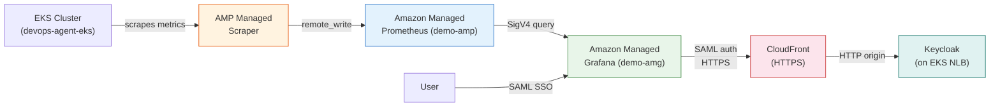
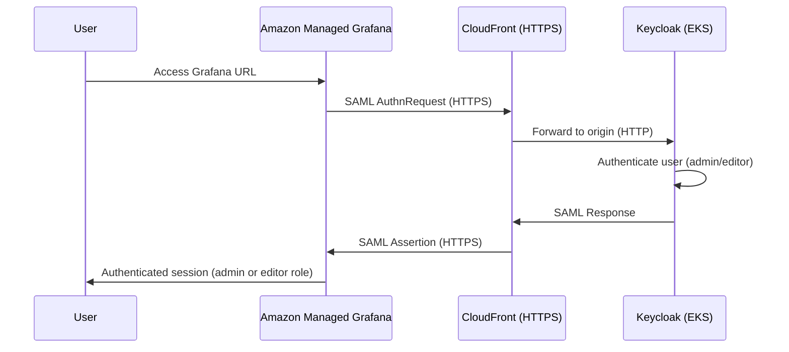
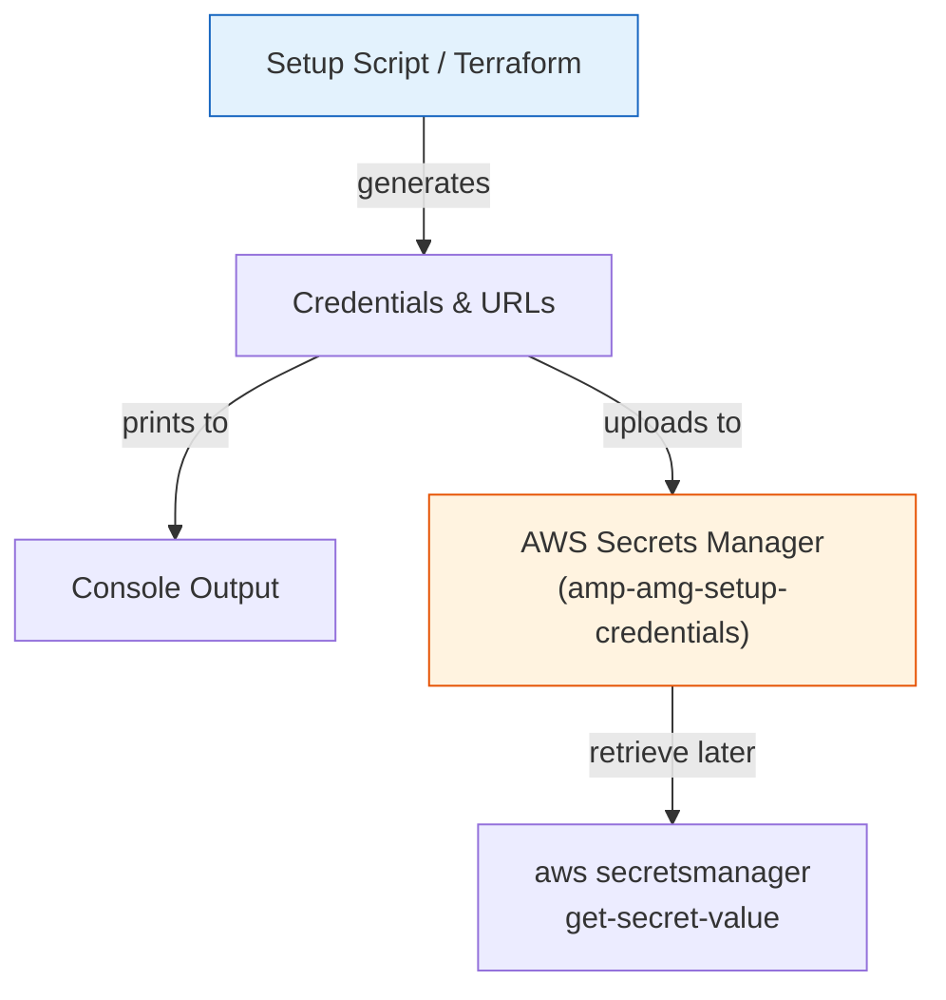

# AMP + AMG Setup with Keycloak SAML

End-to-end setup of Amazon Managed Prometheus and Amazon Managed Grafana with Keycloak SAML authentication, a managed scraper for EKS metrics, CloudFront HTTPS termination for Keycloak, and a pre-loaded Kubernetes monitoring dashboard. Credentials and URLs are persisted to AWS Secrets Manager.

## Architecture



## SAML Authentication Flow



## Credential Persistence



## What it creates

| Resource | Description |
|----------|-------------|
| AMP workspace (demo-amp) | Prometheus-compatible metrics store |
| Managed scraper (demo-amp-scraper) | Agentless metric collection from EKS |
| RBAC (ClusterRole/Binding) | Scraper access to Kubernetes metrics endpoints |
| eksctl IAM identity mapping | Maps scraper role to `aps-collector-user` in aws-auth |
| Keycloak namespace | Kubernetes namespace for Keycloak deployment |
| Keycloak (on EKS) | SAML IdP with admin/editor users (Helm release) |
| StorageClass (ebs-sc) | EBS storage for Keycloak PostgreSQL |
| CloudFront distribution | HTTPS termination in front of Keycloak NLB |
| Keycloak realm (amg) | Realm with admin/editor users and SAML client |
| AMG workspace (demo-amg) | Grafana with SAML auth via Keycloak (HTTPS) |
| AMG IAM role | Service role with AMP read permissions |
| AMP datasource in AMG | SigV4-authenticated Prometheus datasource |
| Dashboard 3119 | Kubernetes cluster monitoring (via Prometheus) |
| Secrets Manager secret | Persisted credentials, URLs, and config |

## Prerequisites

- EKS cluster `devops-agent-eks` running with EBS CSI driver addon
- AWS CLI, jq, kubectl, curl, openssl, helm
- `eksctl` (for scraper IAM identity mapping; optional but recommended)

## Usage

```bash
chmod +x setup-amp-amg.sh cleanup-amp-amg.sh

./setup-amp-amg.sh --region us-east-1
```

Retrieve stored credentials later:
```bash
aws secretsmanager get-secret-value --secret-id amp-amg-setup-credentials --region us-east-1
```

## Options

| Flag | Description | Default |
|------|-------------|---------|
| `--region` | AWS region (required) | — |
| `--cluster` | EKS cluster name | devops-agent-eks |
| `--amp-alias` | AMP workspace alias | demo-amp |
| `--amg-name` | AMG workspace name | demo-amg |
| `--keycloak-namespace` | Keycloak K8s namespace | keycloak |
| `--keycloak-realm` | Keycloak realm | amg |

## Steps performed

1. Creates AMP workspace and waits for ACTIVE
2. Initiates managed scraper creation with RBAC + eksctl identity mapping (does not wait — runs in background)
3. Deploys Keycloak on EKS (Helm, auto-detects EBS CSI provisioner, StorageClass, LB health check)
4. Creates CloudFront distribution in front of Keycloak NLB for HTTPS termination
5. Creates AMG workspace with SAML auth provider and IAM role (AMP read permissions)
6. Configures Keycloak realm (amg), admin/editor users, and SAML client for the AMG workspace
7. Updates AMG SAML config to use CloudFront HTTPS URL for the IdP metadata
8. Creates a Grafana API key, adds AMP as a SigV4 Prometheus datasource
9. Downloads and imports Grafana dashboard 3119 (Kubernetes cluster monitoring)
10. Waits for managed scraper to become ACTIVE (usually done by now)
11. Uploads all credentials and URLs to AWS Secrets Manager

## Cleanup

```bash
./cleanup-amp-amg.sh --region us-east-1
```

Removes: CloudFront distribution, Secrets Manager secret, managed scraper, eksctl IAM identity mapping, RBAC resources, Keycloak realm (amg), Keycloak Helm release + namespace + StorageClass, AMG workspace + IAM role, AMP workspace.

Use `--skip-keycloak` to keep Keycloak intact if it is shared with other workloads.
Use `--skip-secrets` to keep the Secrets Manager secret.

## Terraform

The `terraform/` directory provides a full IaC equivalent of the setup script.

```bash
cd terraform
terraform init
terraform plan -var="aws_region=us-east-1"
terraform apply -var="aws_region=us-east-1"
```

Resources managed natively by Terraform: AMP workspace, managed scraper, AMG workspace, IAM role, RBAC (ClusterRole/Binding), StorageClass, Keycloak (Helm), CloudFront distribution. Keycloak SAML config, AMG SAML auth, Secrets Manager upload, datasource, and dashboard import use `null_resource` with `local-exec` provisioners (requires kubectl, helm, eksctl, jq, curl, openssl on the machine running Terraform).

To destroy:
```bash
terraform destroy -var="aws_region=us-east-1"
```

## CloudFormation

The `cloudformation/` directory provides a two-step approach:

1. Deploy the CFN stack (creates AMP, AMG, IAM role):
```bash
aws cloudformation deploy \
  --template-file cloudformation/amp-amg-stack.yaml \
  --stack-name amp-amg-stack \
  --capabilities CAPABILITY_NAMED_IAM \
  --parameter-overrides AwsRegion=us-east-1
```

2. Run the companion script for resources that need kubectl/helm:
```bash
chmod +x cloudformation/post-deploy.sh
./cloudformation/post-deploy.sh --region us-east-1 --stack-name amp-amg-stack
```

To destroy:
```bash
./cleanup-amp-amg.sh --region us-east-1
aws cloudformation delete-stack --stack-name amp-amg-stack
```

## Troubleshooting

| Issue | Fix |
|-------|-----|
| Scraper stuck in CREATING | Check EKS security groups allow scraper ENIs; verify subnet connectivity |
| Dashboard shows no data | Wait 2-3 minutes for scraper to start collecting; check AMP has metrics via `awscurl` |
| SAML login fails | Verify CloudFront distribution is Deployed and SAML URL is reachable via HTTPS |
| Datasource returns 403 | AMG workspace role missing AMP read permissions |
| CloudFront 502/504 | Keycloak NLB target not healthy; check pod status and LB target group |
| `eksctl` not found | Install eksctl or manually add scraper role to aws-auth configmap |
| Credentials lost | Retrieve from Secrets Manager: `aws secretsmanager get-secret-value --secret-id amp-amg-setup-credentials` |
