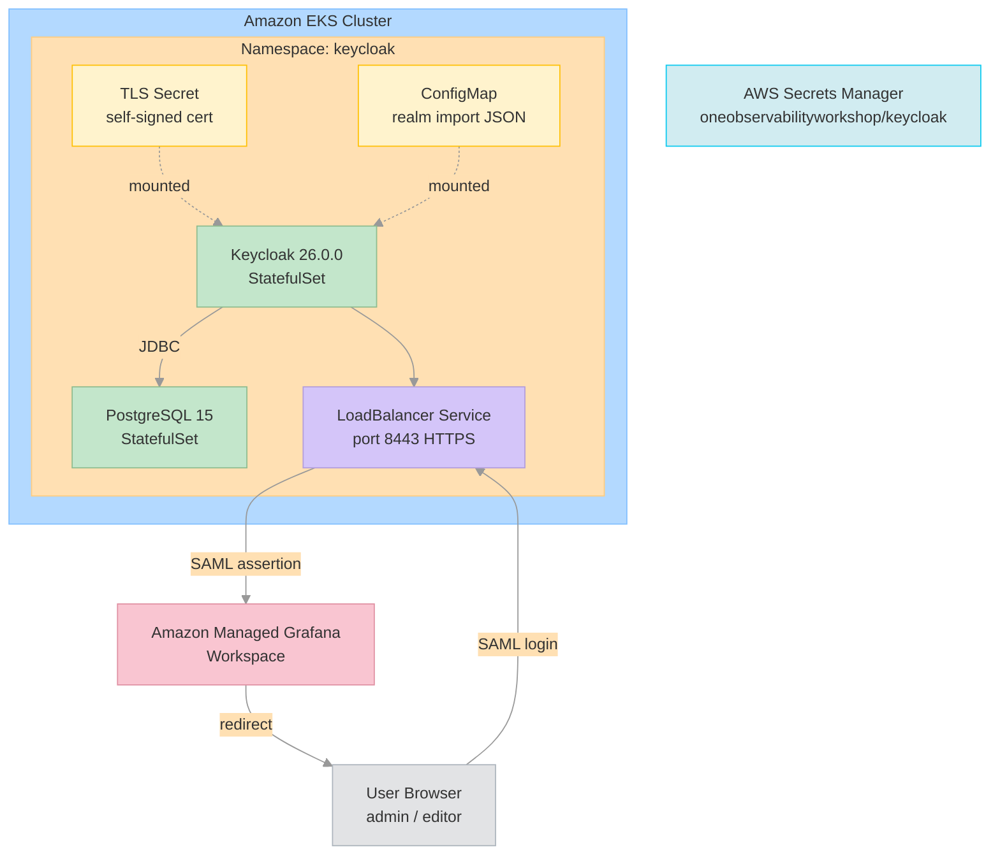
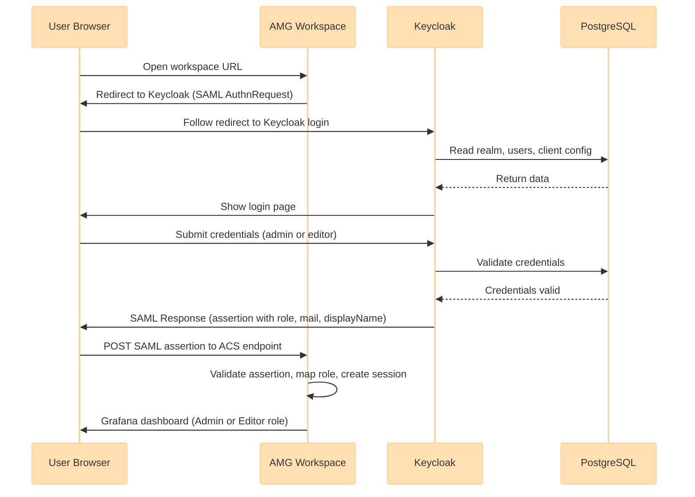

# Keycloak SAML Setup for Amazon Managed Grafana (AMG) on Amazon EKS

This project provides scripts that deploy Keycloak on Amazon EKS and configure it as a SAML Identity Provider (IdP) for Amazon Managed Grafana (AMG).

The setup script automates the following:

- validate access to an existing EKS cluster
- locate an existing AMG workspace
- deploy PostgreSQL 15 as a StatefulSet for Keycloak persistence
- generate a self-signed TLS certificate for HTTPS
- deploy Keycloak 26.0.0 as a StatefulSet with realm import
- create a Keycloak realm with users, roles, and SAML client for AMG
- update the AMG workspace to use Keycloak for SAML authentication
- store all credentials in AWS Secrets Manager

The result is a working SAML login flow where users sign in to AMG through Keycloak.

## What This Setup Builds

At a high level, the script builds this solution:

| Component | Role |
|-----------|------|
| Amazon Managed Grafana | Relying party / service provider |
| Keycloak 26.0.0 | SAML identity provider |
| PostgreSQL 15 | Keycloak persistence layer |
| Amazon EKS | Runtime platform |
| AWS Network Load Balancer | Exposes Keycloak externally (created by Kubernetes service) |
| AWS Secrets Manager | Stores generated credentials |

## Architecture Diagram



## Component Diagram

```
Script
├── AWS CLI
│    ├── EKS (kubeconfig)
│    ├── Grafana (workspace lookup + SAML config)
│    └── Secrets Manager (credential storage)
├── kubectl (namespace, secrets, StatefulSets, services, configmaps)
├── openssl (TLS certificate + PKCS12 keystore generation)
├── curl (Keycloak health checks + SAML metadata retrieval)
└── jq (JSON parsing)

EKS Cluster
└── Namespace: keycloak
     ├── StatefulSet: keycloak (quay.io/keycloak/keycloak:26.0.0)
     ├── StatefulSet: keycloak-postgresql (postgres:15)
     ├── Service: keycloak (LoadBalancer, port 8443)
     ├── Secret: keycloak-db-secret
     ├── Secret: keycloak-tls (PKCS12 keystore)
     └── ConfigMap: keycloak-realm-import

Keycloak Realm: amg
├── Roles
│    ├── admin
│    └── editor
├── Users
│    ├── admin (role: admin)
│    └── editor (role: editor)
└── SAML Client
     ├── Client ID: https://<workspace-endpoint>/saml/metadata
     ├── Redirect URI: https://<workspace-endpoint>/saml/acs
     └── Protocol Mappers: mail, displayName, role

AMG Workspace
└── SAML configuration
     ├── IdP metadata (XML, passed directly)
     ├── Assertion attributes (mail, displayName, role)
     └── Role mappings (admin → Admin, editor → Editor)
```

## SAML Login Sequence Diagram



## Data Flows

### 1. Deployment and Control Flow

This is the flow when the script runs:

1. The script validates required tools (`aws`, `kubectl`, `openssl`, `jq`, `curl`).
2. The script updates kubeconfig to target the EKS cluster.
3. The script finds the AMG workspace and retrieves the endpoint URL.
4. The script generates random passwords for Keycloak admin, realm users, and the database.
5. The script creates the `keycloak` namespace.
6. The script creates the database secret in Kubernetes.
7. The script deploys PostgreSQL 15 as a StatefulSet and waits for readiness.
8. The script generates a self-signed TLS certificate and creates a PKCS12 keystore.
9. The script creates a TLS secret in Kubernetes from the keystore.
10. The script renders the realm template JSON with workspace-specific values (entity ID, ACS URL, passwords).
11. The script creates a ConfigMap with the rendered realm JSON for Keycloak import.
12. The script deploys Keycloak 26.0.0 as a StatefulSet with TLS and realm import volumes mounted.
13. The script waits for the Keycloak pod to be ready and the LoadBalancer to get a hostname.
14. The script polls the Keycloak HTTPS endpoint until it responds.
15. The script retrieves the SAML metadata XML from Keycloak.
16. The script updates the AMG workspace SAML configuration with the metadata XML and role mappings.
17. The script stores all credentials in AWS Secrets Manager.

### 2. Authentication Runtime Flow

This is the flow after deployment:

1. The user opens the AMG workspace URL.
2. AMG redirects the browser to Keycloak because SAML is enabled.
3. Keycloak authenticates the user in the configured realm.
4. Keycloak sends the SAML assertion back to AMG.
5. AMG maps the SAML attributes:
   - `mail` → login / email
   - `displayName` → display name
   - `role` → workspace role
6. The user lands in AMG as either Admin or Editor.

### 3. Persistence Flow

Keycloak stores the following in PostgreSQL:

- realm configuration
- users and credentials
- role mappings
- SAML client configuration
- protocol mapper configuration

> **Note:** PostgreSQL uses `emptyDir` for storage. Data is lost on pod restart. This is acceptable for workshop/demo use.

## What the Script Configures

### Keycloak Deployment

Keycloak is deployed as a Kubernetes StatefulSet using the official image (`quay.io/keycloak/keycloak:26.0.0`). PostgreSQL is deployed as a separate StatefulSet using the official `postgres:15` image.

Kubernetes resources created:

| Resource | Name | Description |
|----------|------|-------------|
| Namespace | `keycloak` | Isolated environment |
| StatefulSet | `keycloak` | Keycloak 26.0.0 (dev mode, HTTPS) |
| StatefulSet | `keycloak-postgresql` | PostgreSQL 15 |
| Service | `keycloak` | LoadBalancer (NLB, port 8443) |
| Service | `keycloak-postgresql` | ClusterIP (port 5432) |
| Secret | `keycloak-db-secret` | Database credentials |
| Secret | `keycloak-tls` | PKCS12 keystore for HTTPS |
| ConfigMap | `keycloak-realm-import` | Realm JSON for auto-import |

### Keycloak Realm Model

The script creates a realm named `amg` (configurable via `--keycloak-realm`). Inside this realm:

| Type | Name | Details |
|------|------|---------|
| Role | `admin` | Maps to AMG Admin role |
| Role | `editor` | Maps to AMG Editor role |
| User | `admin` | Assigned `admin` role, random 25-char password |
| User | `editor` | Assigned `editor` role, random 25-char password |
| SAML Client | `https://<endpoint>/saml/metadata` | Configured with ACS URL and protocol mappers |

### SAML Client for AMG

The SAML client is created using the AMG workspace endpoint:

- Client ID: `https://<workspace-endpoint>/saml/metadata`
- Redirect URI: `https://<workspace-endpoint>/saml/acs`

### AMG SAML Configuration

The script configures AMG to use Keycloak metadata and applies the SAML assertion mappings:

| AMG field | SAML attribute |
|-----------|----------------|
| Login | `mail` |
| Email | `mail` |
| Name | `displayName` |
| Role | `role` |

Role mapping:

| Keycloak role | AMG role |
|---------------|----------|
| `admin` | Admin |
| `editor` | Editor |

> **Note:** Because the script uses a self-signed TLS certificate, the SAML metadata XML is passed directly to AMG instead of a metadata URL.

### LoadBalancer Configuration

The script creates an internet-facing Network Load Balancer (NLB) to expose Keycloak on port 8443 (HTTPS). This is required for:

- SAML authentication flow with Amazon Managed Grafana
- Admin console access for configuration
- User authentication from browsers

LoadBalancer annotations:

| Annotation | Value | Purpose |
|------------|-------|---------|
| `aws-load-balancer-scheme` | `internet-facing` | Public access |
| `aws-load-balancer-type` | `external` | AWS LB Controller |
| `aws-load-balancer-nlb-target-type` | `instance` | Instance targeting |

## Prerequisites

Before running the script, make sure you have:

- An existing Amazon EKS cluster
- An existing Amazon Managed Grafana workspace
- AWS CLI configured with permissions to manage: EKS, IAM, ELBv2, Grafana, STS, Secrets Manager
- The following tools available in your shell:

| Tool | Purpose |
|------|---------|
| `aws` | AWS resource management |
| `kubectl` | Kubernetes operations |
| `openssl` | TLS certificate and password generation |
| `jq` | JSON parsing |
| `curl` | HTTP requests and health checks |

## Script Inputs

### keycloak-setup.sh

| Parameter | Required | Default | Description |
|-----------|----------|---------|-------------|
| `-c, --cluster-name` | Yes | — | Amazon EKS cluster name |
| `-w, --workspace-name` | Yes | — | Amazon Managed Grafana workspace name |
| `-n, --keycloak-namespace` | No | `keycloak` | Namespace where Keycloak is deployed |
| `-r, --keycloak-realm` | No | `amg` | Keycloak realm used for AMG |
| `-h, --help` | No | — | Show help message |

### keycloak-cleanup.sh

| Parameter | Required | Default | Description |
|-----------|----------|---------|-------------|
| `-c, --cluster-name` | Yes | — | Amazon EKS cluster name |
| `-w, --workspace-name` | Yes | — | Amazon Managed Grafana workspace name |
| `-n, --keycloak-namespace` | No | `keycloak` | Namespace where Keycloak is deployed |
| `-h, --help` | No | — | Show help message |

## Example Usage

### Setup

Set variables:

```bash
CLUSTER_NAME=PetsiteEKS-cluster
WORKSPACE_NAME=demo-amg
KEYCLOAK_NAMESPACE=keycloak
KEYCLOAK_REALM=amg
```

Run the script:

```bash
chmod +x keycloak-setup.sh

./keycloak-setup.sh \
  --cluster-name "$CLUSTER_NAME" \
  --workspace-name "$WORKSPACE_NAME" \
  --keycloak-namespace "$KEYCLOAK_NAMESPACE" \
  --keycloak-realm "$KEYCLOAK_REALM"
```

### Cleanup

```bash
chmod +x keycloak-cleanup.sh

./keycloak-cleanup.sh \
  --cluster-name "$CLUSTER_NAME" \
  --workspace-name "$WORKSPACE_NAME" \
  --keycloak-namespace "$KEYCLOAK_NAMESPACE"
```

### CloudShell-Friendly Deployment

If running from AWS CloudShell:

1. Set your variables
2. Download or copy the script and realm template
3. Run `chmod +x keycloak-setup.sh`
4. Run the script
5. Wait for completion — the script will deploy all components and configure SAML
6. Save the final output (credentials and URLs)

## Example Output

The exact values will differ, but the output looks like this:

```
---------------------------------------------------------------------------------------------
Keycloak setup complete!
---------------------------------------------------------------------------------------------

Keycloak URL: https://k8s-keycloak-keycloak-xxxxxxxxxx.elb.us-east-2.amazonaws.com:8443
Realm: amg

Admin User:
  Username: admin
  Password: <generated-password>

Editor User:
  Username: editor
  Password: <generated-password>

Grafana URL: https://g-xxxxxxxxxx.grafana-workspace.us-east-2.amazonaws.com

Credentials stored in AWS Secrets Manager: oneobservabilityworkshop/keycloak

To retrieve credentials later:
  aws secretsmanager get-secret-value --secret-id oneobservabilityworkshop/keycloak --region us-east-2 --query SecretString --output text | jq .
```

## Testing the Login Flow

After the script completes:

1. Open the AMG workspace URL.
2. Choose **Sign in with SAML**.
3. Sign in with one of the realm users (`admin` or `editor`).
4. Verify the resulting AMG role matches the Keycloak role.

## Retrieving Credentials

Credentials are stored in AWS Secrets Manager and printed during setup.

```bash
# Get all credentials
aws secretsmanager get-secret-value \
  --secret-id oneobservabilityworkshop/keycloak \
  --region <your-region> \
  --query SecretString \
  --output text | jq .

# Keycloak admin console password
aws secretsmanager get-secret-value \
  --secret-id oneobservabilityworkshop/keycloak \
  --query SecretString --output text | jq -r '.["admin-password"]'

# Grafana admin user password
aws secretsmanager get-secret-value \
  --secret-id oneobservabilityworkshop/keycloak \
  --query SecretString --output text | jq -r '.["user-admin-password"]'

# Grafana editor user password
aws secretsmanager get-secret-value \
  --secret-id oneobservabilityworkshop/keycloak \
  --query SecretString --output text | jq -r '.["user-editor-password"]'
```

## Operational Notes

### Re-running the Script

The script is designed to be re-runnable for most steps:

- It uses `--dry-run=client -o yaml | kubectl apply` for secrets and namespace creation
- It applies StatefulSets and services idempotently
- It creates or updates the Secrets Manager secret
- It updates AMG authentication configuration

### Keycloak Pod Assumptions

The script expects the main Keycloak pod to be named `keycloak-0`. This matches the StatefulSet naming convention.

### Password Behavior

- Keycloak master admin password is generated during script execution and passed as an environment variable
- Realm test user passwords are generated during script execution and baked into the realm import JSON
- All passwords are 25-character random strings generated with `openssl rand`
- All passwords are stored in AWS Secrets Manager

### TLS and Metadata

- The script generates a self-signed TLS certificate for Keycloak HTTPS (port 8443)
- Because the certificate is self-signed, the SAML metadata XML is retrieved and passed directly to AMG (not as a URL)
- The metadata URL format is: `https://<load-balancer-hostname>:8443/realms/<realm>/protocol/saml/descriptor`

## Troubleshooting

### Check pods

```bash
kubectl get pods -n keycloak
```

### Check Keycloak logs

```bash
kubectl logs -n keycloak keycloak-0
```

### Check services

```bash
kubectl get svc -n keycloak
kubectl describe svc keycloak -n keycloak
```

### Check load balancer hostname

```bash
kubectl get svc keycloak -n keycloak \
  -o jsonpath='{.status.loadBalancer.ingress[0].hostname}'
```

### Inspect Keycloak manually

```bash
kubectl exec -n keycloak keycloak-0 -- bash
```

Inside the container, the admin CLI is at:

```
/opt/keycloak/bin/kcadm.sh
```

### Verify AMG authentication config

```bash
aws grafana describe-workspace-authentication \
  --workspace-id <workspace-id>
```

### Database connection issues

```bash
kubectl get pod keycloak-postgresql-0 -n keycloak
kubectl logs keycloak-postgresql-0 -n keycloak
kubectl get secret keycloak-db-secret -n keycloak -o yaml
```

## Security Considerations

### For Workshops and Demos

- ✅ Uses Keycloak dev mode (simpler, faster startup)
- ✅ HTTPS with self-signed TLS certificate
- ✅ Passwords randomly generated (25 characters)
- ✅ Credentials stored in AWS Secrets Manager
- ✅ Isolated Kubernetes namespace
- ✅ No dependency on third-party Helm charts or image registries

### For Production

Consider these enhancements:

- Use Keycloak production mode with a custom-built image
- Enable HTTPS with valid certificates from ACM or Let's Encrypt
- Use persistent volumes for PostgreSQL (EBS CSI driver)
- Use AWS RDS instead of a PostgreSQL pod
- Implement backup and disaster recovery
- Configure resource limits and requests
- Enable monitoring and alerting
- Implement network policies
- Restrict LoadBalancer access via security groups
- Use AWS WAF for additional protection

## Performance

Typical deployment time: **3–5 minutes**

| Step | Duration |
|------|----------|
| PostgreSQL deployment | ~30 seconds |
| TLS certificate generation | ~5 seconds |
| Keycloak deployment | ~90 seconds |
| LoadBalancer provisioning | ~60 seconds |
| Keycloak health check | ~30 seconds |
| AMG SAML configuration | ~15 seconds |

## Limitations

- **Dev Mode**: Keycloak runs in development mode (not for production)
- **Storage**: PostgreSQL uses `emptyDir` (data lost on pod restart)
- **Self-signed TLS**: Certificate is not trusted by browsers (expect warnings)
- **Single Instance**: No high availability
- **No Helm**: Deployed as raw Kubernetes manifests (intentional — avoids Bitnami/Helm dependency)

## Repository Layout

```
.
├── keycloak-setup.sh              # Deployment and configuration script
├── keycloak-cleanup.sh            # Resource removal script
├── keycloak-realm-template.json   # Realm import template (parameterized)
└── KEYCLOAK_README.md             # This file
```

## Summary

This script provides an automated, repeatable way to:

- deploy Keycloak on EKS as a StatefulSet (no Helm charts)
- persist Keycloak state in PostgreSQL
- secure Keycloak with self-signed TLS
- create a dedicated realm for AMG with users and roles
- configure SAML authentication between Keycloak and AMG
- test login with pre-created users and role mappings
- store all credentials securely in AWS Secrets Manager

It is a practical setup for enabling SAML-based access to Amazon Managed Grafana through Keycloak on Kubernetes.

## License

Copyright 2023 Amazon.com, Inc. or its affiliates. All Rights Reserved.
SPDX-License-Identifier: MIT-0
