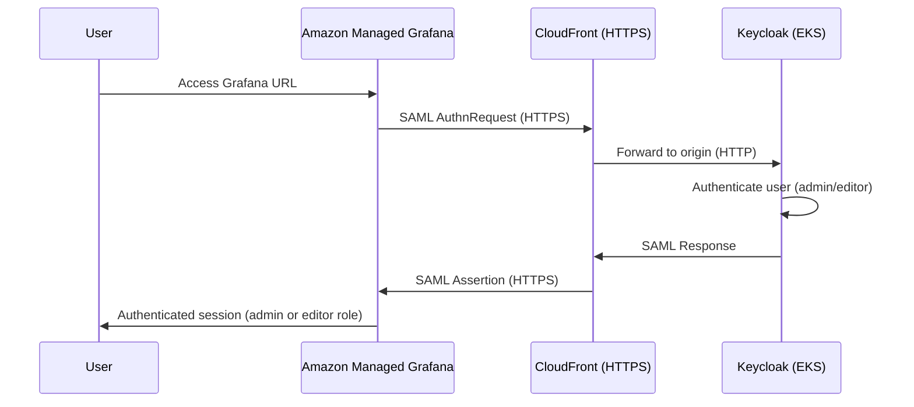
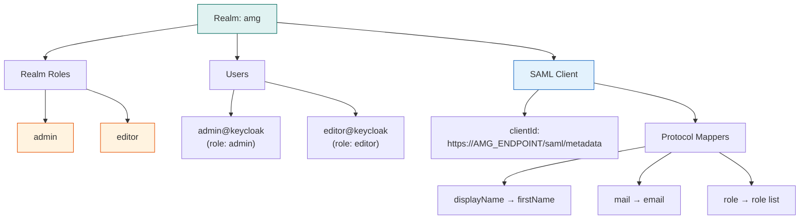

# Keycloak Setup for AMG SAML Authentication

Keycloak is deployed on EKS as the SAML Identity Provider for Amazon Managed Grafana. It provides admin and editor role-based access via a dedicated realm, fronted by CloudFront for HTTPS termination.

## Architecture

```mermaid
flowchart LR
    User["User"] -->|SAML SSO| AMG["Amazon Managed\nGrafana (demo-amg)"]
    AMG -->|SAML AuthnRequest\nHTTPS| CF["CloudFront\n(HTTPS termination)"]
    CF -->|HTTP origin| NLB["NLB\n(internet-facing)"]
    NLB --> KC["Keycloak Pod\n(keycloak-0)"]
    KC --> PG["PostgreSQL\n(PVC via ebs-sc)"]
    PG --> EBS["EBS Volume\n(gp3)"]

    style KC fill:#e0f2f1,stroke:#00695c
    style CF fill:#fce4ec,stroke:#c62828
    style AMG fill:#e8f5e9,stroke:#2e7d32
    style PG fill:#e3f2fd,stroke:#1565c0
    style EBS fill:#fff3e0,stroke:#e65100
```

## SAML Authentication Flow

## Keycloak Deployment Flow

```mermaid
flowchart TD
    Start(["Step 3: Deploy Keycloak"]) --> CheckRunning{"Keycloak pod\nalready Running?"}
    CheckRunning -->|Yes| SkipDeploy["Skip deployment"]
    CheckRunning -->|No| InstallHelm{"helm\ninstalled?"}
    InstallHelm -->|No| GetHelm["Install helm via\nget-helm-3 script"]
    InstallHelm -->|Yes| AddRepo["Add bitnami Helm repo"]
    GetHelm --> AddRepo
    AddRepo --> EnsureNS["Create keycloak namespace"]
    EnsureNS --> DetectCSI{"EBS CSI driver\nregistered?"}

    DetectCSI -->|"ebs.csi.eks.amazonaws.com\nor ebs.csi.aws.com"| SCCheck
    DetectCSI -->|Not found| InstallCSI["Auto-install\naws-ebs-csi-driver addon"]

    InstallCSI --> CreateIAM["Create IAM role\n(eksctl or raw IAM API)"]
    CreateIAM --> OIDC["Ensure OIDC provider\nassociated with cluster"]
    OIDC --> CreateAddon["aws eks create-addon\n--addon-name aws-ebs-csi-driver"]
    CreateAddon --> WaitAddon{"Wait for addon\nACTIVE (up to 10 min)"}
    WaitAddon -->|ACTIVE| ReDetect["Re-detect CSI provisioner"]
    WaitAddon -->|CREATE_FAILED| Fail(["die: addon creation failed"])
    ReDetect --> SCCheck

    SCCheck{"StorageClass\nebs-sc exists?"}
    SCCheck -->|"Yes, correct provisioner"| HelmInstall
    SCCheck -->|"Yes, wrong provisioner"| FixSC["Delete stuck PVCs\nRecreate StorageClass"]
    SCCheck -->|No| CreateSC["Create StorageClass\nebs-sc"]
    FixSC --> HelmInstall
    CreateSC --> HelmInstall

    HelmInstall["helm upgrade --install keycloak\nbitnami/keycloak v24.2.3"]
    HelmInstall --> WaitPod{"Wait for keycloak-0\nRunning (up to 15 min)"}
    WaitPod -->|Running| GetPassword["Retrieve admin password\nfrom K8s secret"]
    WaitPod -->|Timeout| FailPod(["die: pod not Running"])

    GetPassword --> WaitLB["Wait for NLB\nhostname assignment"]
    WaitLB --> WaitHealth["Wait for NLB target\nto become healthy"]
    WaitHealth --> CloudFront{"CloudFront dist\nalready exists?"}
    CloudFront -->|Yes| Done
    CloudFront -->|No| CreateCF["Create CloudFront distribution\n(HTTPS → HTTP origin)"]
    CreateCF --> WaitCF["Wait for CloudFront\nDeployed status"]
    WaitCF --> Done(["Keycloak ready\nSAML URL available"])

    SkipDeploy --> GetPassword

    style Start fill:#e0f2f1,stroke:#00695c
    style Done fill:#e8f5e9,stroke:#2e7d32
    style Fail fill:#ffebee,stroke:#c62828
    style FailPod fill:#ffebee,stroke:#c62828
    style InstallCSI fill:#fff3e0,stroke:#e65100
    style CreateAddon fill:#fff3e0,stroke:#e65100
    style WaitAddon fill:#fff3e0,stroke:#e65100
    style ReDetect fill:#fff3e0,stroke:#e65100
```

## Keycloak Realm Configuration

## Resources Created

| Resource | Description |
|----------|-------------|
| Namespace `keycloak` | Kubernetes namespace for all Keycloak resources |
| Helm release `keycloak` | bitnami/keycloak v24.2.3 with PostgreSQL |
| StorageClass `ebs-sc` | EBS-backed storage for PostgreSQL PVC |
| aws-ebs-csi-driver addon | Auto-installed if not already present (with IAM role) |
| NLB (internet-facing) | Load balancer exposing Keycloak on port 80 |
| CloudFront distribution | HTTPS termination in front of the NLB |
| Realm `amg` | Keycloak realm with SAML client, roles, and users |
| Secrets Manager | Keycloak credentials persisted to `amp-amg-setup-credentials` |

## Prerequisites

- EKS cluster running (default: `devops-agent-eks`)
- AWS CLI, kubectl, helm, jq, curl, openssl
- `eksctl` (optional, used for IAM role creation)

> The EBS CSI driver is no longer a hard prerequisite. If missing, the setup script automatically creates the IAM role, installs the addon, and waits for it to become active.

## Helm Values

| Setting | Value |
|---------|-------|
| Chart | bitnami/keycloak |
| Version | 24.2.3 |
| Image | public.ecr.aws/bitnami/keycloak:22.0.1-debian-11-r36 |
| Service type | LoadBalancer (NLB, internet-facing) |
| PostgreSQL | Enabled (docker.io/postgres:16) |
| StorageClass | ebs-sc |
| CPU request/limit | 500m / 750m |
| Memory request/limit | 512Mi / 768Mi |

## Troubleshooting

| Issue | Fix |
|-------|-----|
| Keycloak pod stuck in Pending | Check PVC status — StorageClass provisioner may not match the CSI driver |
| EBS CSI addon stuck in CREATING | Verify IAM role trust policy and OIDC provider association |
| NLB target unhealthy | Check keycloak-0 pod logs and readiness probe |
| SAML login fails | Verify CloudFront is Deployed and SAML URL is reachable via HTTPS |
| CloudFront 502/504 | Keycloak NLB target not healthy; check pod status |
| Wrong StorageClass provisioner | Script auto-detects and recreates; delete stuck PVCs manually if needed |

## Related Scripts

- [`../scripts/amp-amg-setup/setup-amp-amg.sh`](../scripts/amp-amg-setup/setup-amp-amg.sh) — Full setup (Keycloak is Step 3)
- [`../scripts/amp-amg-setup/cleanup-amp-amg.sh`](../scripts/amp-amg-setup/cleanup-amp-amg.sh) — Cleanup (use `--skip-keycloak` to preserve)
